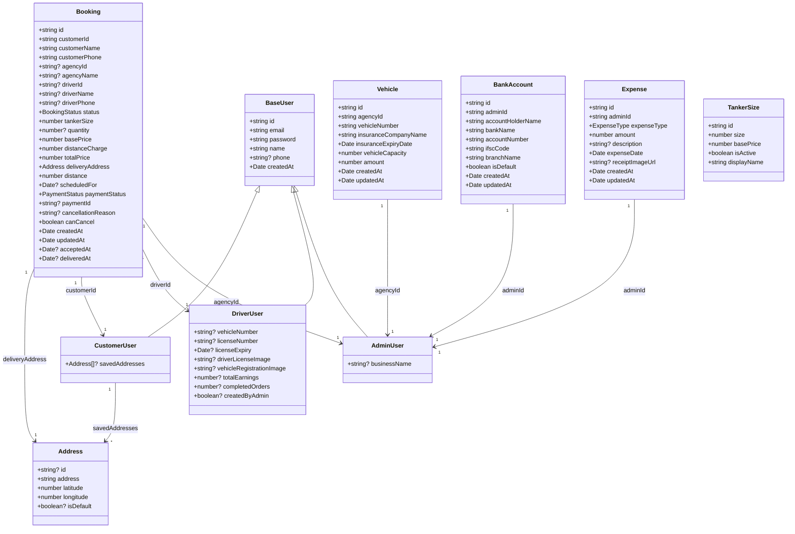
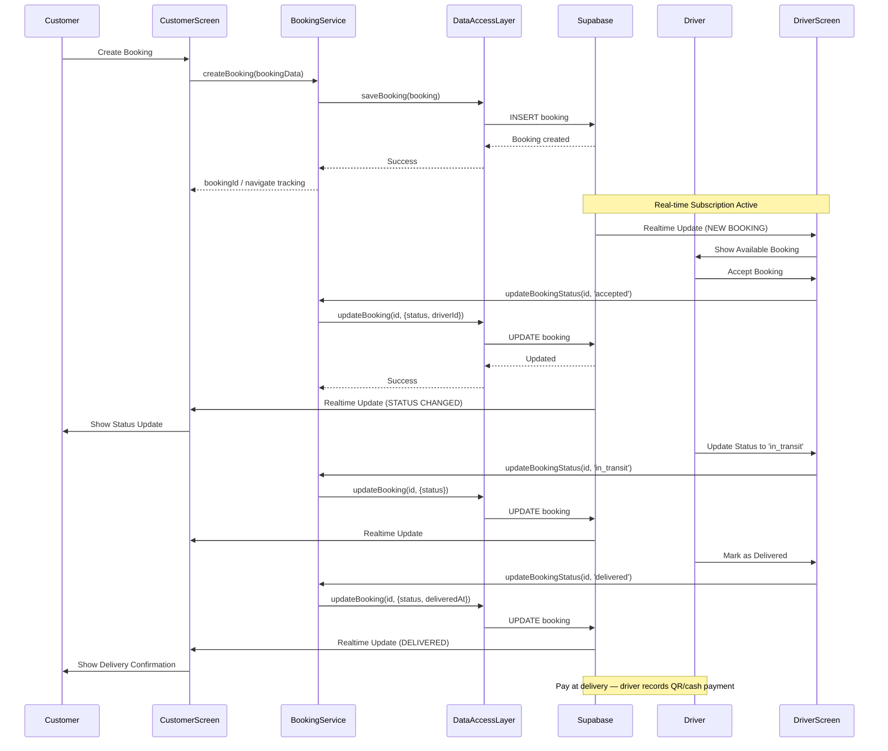
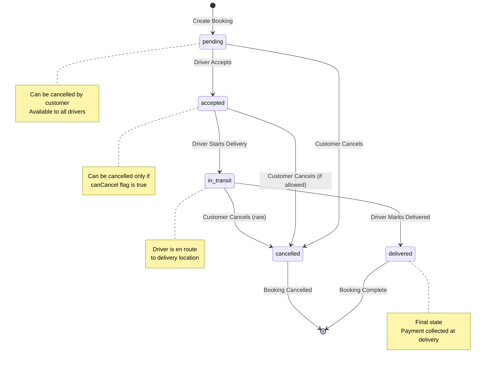
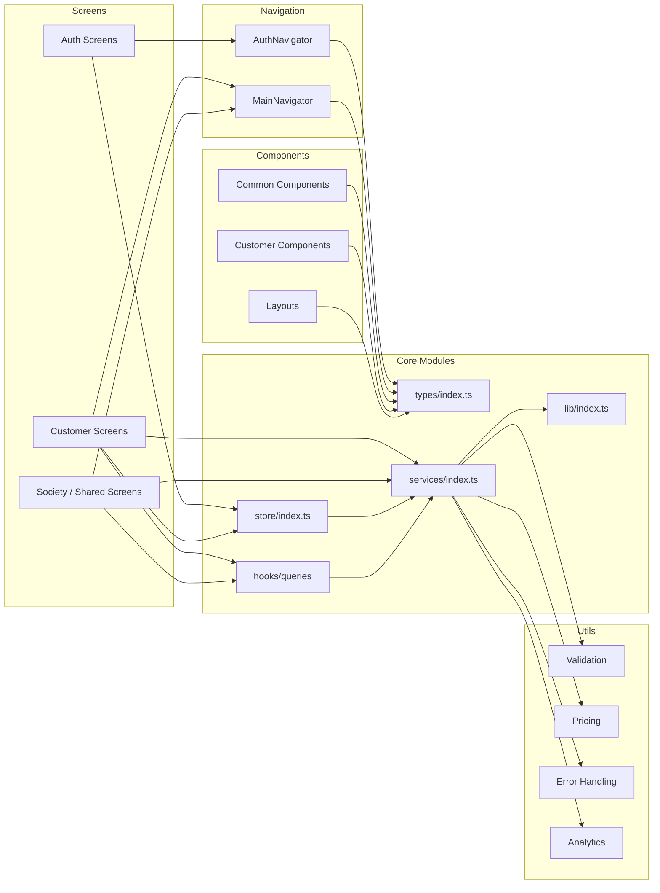

# WTC — Water Tanker Customer App

A **customer-facing** mobile app (**WTC**) for on-demand water tanker delivery, built with **React Native (Expo)** and **TypeScript**, backed by **Supabase** (PostgreSQL, Auth, Realtime). Driver and admin tools live in **separate applications** that share the same Supabase project.

This client only mounts **Auth** and **Customer** flows (`App.tsx`). Users restored as non-customer (e.g. staff) are sent back to sign-in.

Customers can sign in as **individual** or **society** accounts (same customer role; account kind differs). **Active subscriptions** are required to create bookings and society trips (enforced in app and database). Subscription purchase/renewal (**Flow A**) uses **Razorpay** via Supabase Edge Functions and `react-native-razorpay` (requires an **Expo dev client** or EAS build — not Expo Go). **Booking payment is collected at delivery** — the customer scans the driver's QR code or pays cash, and the driver app records it. Booking Razorpay Edge Functions remain server-side for other apps; this client does not open booking checkout.

## Table of Contents

- [Features](#features)
- [Tech Stack](#tech-stack)
- [Architecture](#architecture)
- [UML Diagrams](#uml-diagrams)
- [Prerequisites](#prerequisites)
- [Setup](#setup)
- [Additional documentation](#additional-documentation)
- [NPM scripts](#npm-scripts)
- [Project Structure](#project-structure)
- [Testing](#testing)
- [Supabase Configuration](#supabase-configuration)
- [Troubleshooting](#troubleshooting)
- [Roadmap](#roadmap)

## Features

### Customer Features

- **Booking Management**: Create, view, and track water tanker bookings (requires an active subscription; enforced in app and database)
- **Address Management**: Save and manage multiple delivery addresses (`SavedAddresses` screen)
- **Real-time Tracking**: Track booking status updates in real-time (React Query + Supabase Realtime)
- **Order History**: Current orders and past orders (`Orders`, `PastOrders`)
- **Price Calculation**: Automatic distance-based pricing with Indian numbering format
- **Scheduled Deliveries**: Schedule deliveries for future dates
- **Subscriptions**: Browse plans, subscribe or renew via Razorpay checkout (Flow A), view status, and free-trial provisioning where configured
- **Pay at delivery**: Booking payment is collected when the tanker arrives — scan the driver's QR code or pay cash; the driver app marks the payment received
- **Payment history**: Filterable in-app history for subscription and booking payments (Razorpay order/payment ids where present)
- **Profile (status hub)**: Compact identity strip (Individual vs Society labels) → subscription panel (Active / Expiring soon / Expired) → account actions (Edit Profile, Change Password, Payment history, Contact Us, Appearance) → Delete Account
- **Appearance**: Light, Dark, or System theme (`themeStore`)
- **Society login & trips**: Society-specific login; record and manage society trips and agency trip breakdown (subscription rules apply)
- **Password reset**: Forgot-password email flow with in-app `SetNewPassword` via deep link (`wtccustomer://reset-password`)
- **Delete Account**: Permanently delete account from Profile (with confirmation); removes customer data and bookings, then logs out via `delete-auth-user-on-account-deletion` Edge Function

### Platform note

The same Supabase database supports drivers, admins, and agencies; **this repository does not include driver or admin app screens**. Operational workflows for staff are documented at the backend/RLS level below and in other clients.

## Tech Stack

### Frontend

- **React** 19.x and **React Native** 0.81.x (Expo SDK ~54.0.32)
- **TypeScript** (~5.9.2)
- **React Navigation** v6 (stack navigators for auth and customer)
- **Zustand** (`authStore`, `themeStore`)
- **@tanstack/react-query** (server state: bookings, vehicles, auth profile, realtime invalidation)
- **Expo Location** (GPS and location helpers)
- **react-native-razorpay** (native Razorpay checkout — requires dev client / EAS build)
- **expo-dev-client** (custom dev builds for native modules)
- **expo-font** / **Playfair Display** (display typography)
- **react-native-webview** (hosted flows where used)

### Backend

- **Supabase** (PostgreSQL Database)
- **Supabase Auth** (Authentication)
- **Supabase Realtime** (Real-time Subscriptions)
- **Supabase Edge Functions** (Razorpay orders/verify/webhook, free trial, account deletion)

### Testing

- **Jest** (Unit Testing)
- **React Native Testing Library** (Component Testing)
- **Jest Expo** (Expo-specific Testing)

### Development Tools

- **Expo / EAS CLI** (local dev with `npx expo`; production builds with EAS — see `eas.json`)
- **TypeScript** (Type Safety)
- **ESLint** (Code Quality)

## Architecture

The application follows a **layered architecture** with clear separation of concerns:

1. **Presentation Layer**: React Native screens and components
2. **State Management Layer**: Zustand for auth and theme; React Query for server data
3. **Service Layer**: Business logic and API interactions
4. **Data Access Layer**: Abstracted data persistence interface
5. **Infrastructure Layer**: Supabase client, query client, and utilities

### Key Design Patterns

- **Repository Pattern**: Data Access Layer abstracts database operations
- **Service Layer Pattern**: Business logic separated from UI and data access
- **Observer Pattern**: Real-time subscriptions invalidate React Query caches for live updates
- **Factory Pattern**: Data access layer factory for different backends

## UML Diagrams

### 1. Class Diagram - Core Entities



### 2. Component Diagram - System Architecture (this app)

```mermaid
graph TB
    subgraph "Presentation Layer"
        A[App.tsx] --> B[AuthNavigator]
        A --> C[MainNavigator]
        
        B --> F[RoleSelectionScreen]
        B --> G[LoginScreen]
        B --> H[SocietyLoginScreen]
        B --> HS[RegisterScreen]
        B --> VE[VerifyEmailScreen]
        B --> FP[ForgotPasswordScreen]
        B --> SNP[SetNewPasswordScreen]
        
        C --> I[CustomerHomeScreen]
        C --> J[BookingScreen]
        C --> K[OrderHistoryScreen]
        C --> PO[PastOrdersScreen]
        C --> L[OrderTrackingScreen]
        C --> M[ProfileScreen]
        C --> CP[ChangePasswordScreen]
        C --> SA[SavedAddressesScreen]
        C --> N[SubscriptionPlansScreen]
        C --> NS[SubscriptionStatusScreen]
        C --> PS[PaySubscriptionScreen]
        C --> PR[PaymentResultScreen]
        C --> PH[PaymentHistoryScreen]
        C --> AT[AddTripScreen]
        C --> TD[TripDetailsScreen]
        C --> AB[AgencyTripBreakdownScreen]
    end
    
    subgraph "State Management Layer"
        T[AuthStore]
        TH[ThemeStore]
        RQ[React Query hooks]
    end
    
    subgraph "Service Layer"
        X[AuthService]
        Y[BookingService]
        SY[SocietyTripService]
        SU[SubscriptionService]
        RZ[razorpayCheckout.service]
        Z[UserService]
        AA[PaymentService]
        ABLoc[LocationService]
        AC[VehicleService]
    end
    
    subgraph "Data Access Layer"
        AF[IDataAccessLayer]
        AG[SupabaseDataAccess]
    end
    
    subgraph "Infrastructure Layer"
        AM[Supabase Client]
        QC[QueryClient]
        AN[lib/subscriptionManager]
        AO[ErrorHandler]
        AP[Validation Utils]
        AQ[Pricing Utils]
    end
    
    I --> T
    I --> RQ
    J --> RQ
    M --> T
    M --> TH
    
    T --> X
    RQ --> Y
    RQ --> SU
    RQ --> Z
    RQ --> AC
    AT --> SY
    
    SU --> RZ
    X --> AF
    Y --> AF
    SY --> AF
    SU --> AF
    Z --> AF
    AC --> AF
    AA --> AF
    ABLoc --> AF
    
    AF --> AG
    AG --> AM
    AG --> AN
    RQ --> QC
    X --> AO
    Y --> AP
    Y --> AQ
```



### 3. Sequence Diagram - Booking Flow (platform)

End-to-end booking involves drivers and realtime updates on the **shared backend**. This app implements the **customer** side (`BookingScreen`, `BookingService`); staff use other clients. Booking payment is confirmed in the **driver app** at delivery (QR or cash), not via in-app booking checkout.



### 4. State Diagram - Booking Status Transitions



### 5. Package Diagram - Module Dependencies



## Prerequisites

Before you begin, ensure you have the following installed:

- **Node.js** 18+ and npm
- **Expo** (use `npx expo` — a global `expo-cli` install is not required)
- **EAS CLI** (recommended for dev/production builds with Razorpay: `npx eas-cli`)
- **Android Studio / Xcode** (optional, for local native builds after `npx expo prebuild`)
- **Git** for version control
- **Supabase Account** with a project created
- **Google Maps API Key** (optional, for enhanced location features)

## Setup

### 1. Clone the Repository

```bash
git clone <repository-url>
cd water-customer-app
```

### 2. Install Dependencies

```bash
npm install
```

### 3. Environment Configuration

Create a `.env` file in the project root. **Start from [`.env.example`](./.env.example)** and replace placeholders only locally (never commit real secrets).

Minimum for the app:

```env
EXPO_PUBLIC_SUPABASE_URL=https://your-project-id.supabase.co
EXPO_PUBLIC_SUPABASE_PUBLISHABLE_KEY=sb_publishable_your-key-here
```

Also configure (see `.env.example` for comments and optional keys):

- `EXPO_PUBLIC_RAZORPAY_KEY_ID` — Razorpay Key ID (test or live); secret stays in Edge Function secrets
- `EXPO_PUBLIC_AUTH_SUCCESS_URL` — redirect after email verification (must be listed in Supabase Auth URL configuration)
- `EXPO_PUBLIC_PASSWORD_RESET_REDIRECT_URL` — where password-reset links should land (`wtccustomer://reset-password`)
- `SUPABASE_SECRET_KEY` — **server-side and migration scripts only**; must not appear in client bundles (`npm run secrets:check` helps guard this)

**Supabase API keys:** In Dashboard → Settings → API Keys, use the `default` publishable key (`sb_publishable_...`) for `EXPO_PUBLIC_SUPABASE_PUBLISHABLE_KEY` and the secret key (`sb_secret_...`) for `SUPABASE_SECRET_KEY`. Legacy `EXPO_PUBLIC_SUPABASE_ANON_KEY` and `SUPABASE_SERVICE_ROLE_KEY` still work as fallbacks during transition. Update `eas.json` build env (or EAS secrets) with the publishable key when ready.

Razorpay subscription checkout uses **Supabase Edge Function secrets** (not `EXPO_PUBLIC_*` beyond Key ID). Configure those in the Supabase Dashboard (see `.env.example` comments).

Optional: `EXPO_PUBLIC_GOOGLE_MAPS_API_KEY` for enhanced map features.

### 4. Dev client (required for Razorpay)

`react-native-razorpay` is a native module and does **not** run in Expo Go. Use a custom dev client:

```bash
# One-time: cloud dev APK (Android)
npm run eas:dev:android

# After installing the dev build on device/emulator
npm start
```

Use `npm start` (not plain `npx expo start`) so the QR code uses your PC's LAN IP instead of `localhost`. For remote devices off LAN: `npm run start:dev:tunnel`. iOS: `eas build --profile development --platform ios` (see `package.json` script `_eas_dev_ios`).

### 5. Supabase Database Setup

Apply SQL migrations from [`migrations/`](./migrations/) to your Supabase project (or ensure equivalent schema). Core tables include:

- `users` — Base user table
- `user_roles` — Multi-role support
- `customers` — Customer-specific data
- `drivers` — Driver-specific data
- `admins` — Admin-specific data
- `bookings` — Booking/order table
- `vehicles` — Vehicle management
- `bank_accounts` — Bank account information
- `tanker_sizes` — Tanker size configurations
- `pricing` — Pricing configuration
- `subscription_plans`, `subscriptions`, `payment_transactions` — Subscription and Razorpay payment records
- `society_trips` (and related society migrations) — Society trip flows

Apply every file in [`migrations/`](./migrations/) in **lexicographic (filename) order**. Later payment migrations adjust gateway metadata and RLS for online payments.

**Important**: Row Level Security (RLS) is enabled on all tables with comprehensive policies. Subscription gating for booking and society trip creation is enforced when `FEATURE_FLAGS.enableSubscriptionGating` is `true` (currently enabled in `src/constants/config.ts`). Configure realtime publications for:

- `bookings`
- `notifications`
- `users`
- `user_roles`
- `customers`
- `drivers`
- `admins`
- `bank_accounts`
- `vehicles`
- `expenses`
- `tanker_sizes`
- `pricing`
- `driver_applications`
- `driver_locations`
- `subscription_plans`, `subscriptions`, `payment_transactions` (if using subscriptions)
- `society_trips` (if using society features)

### 6. Start the Development Server

```bash
# Dev client with Razorpay (after EAS dev build is installed)
npm start

# Expo Go only (no Razorpay checkout; limited testing)
npm run start:go

# Or use platform-specific commands
npm run android
npm run ios
npm run web
```

Then choose your platform:

- Press `a` for Android
- Press `i` for iOS
- Press `w` for Web

Tunnel mode: `npm run start:tunnel` (Expo Go) or `npm run start:dev:tunnel` (dev client).

## Additional documentation

| Document | Purpose |
|----------|---------|
| [MONITORING_PLAN.md](./MONITORING_PLAN.md) | Observability, error/security monitoring, and alert runbook (in repo) |

Extended product and implementation notes may exist locally under `docs/` (that folder is **gitignored** and not shipped with clones). Common local-only files include Razorpay phase guides, production readiness checklists, and design specs.

Database changes are versioned under [`migrations/`](./migrations/); apply them to your Supabase project in order when bootstrapping a new environment.

## NPM scripts

| Script | Purpose |
|--------|---------|
| `npm start` | Dev client — LAN (`expo start --dev-client --lan --scheme wtccustomer`) |
| `npm run start:go` | Expo Go with LAN (no Razorpay) |
| `npm run start:dev` | Same as `npm start` |
| `npm run start:dev:tunnel` | Dev client — tunnel for remote devices |
| `npm run start:tunnel` | Expo Go with tunnel |
| `npm run eas:dev:android` | EAS development APK (Android) for Razorpay native module |
| `npm run android` / `ios` / `web` | Start and open a platform |
| `npm run lint` | ESLint (`expo lint`) |
| `npm test` | Full Jest suite |
| `npm run test:release` | Focused release tests (booking, society trips, payments, Razorpay checkout, payment flows) |
| `npm run secrets:check` | Fails if forbidden patterns (e.g. service role, Razorpay key secret) appear under `src/` |
| `npm run prebuild:check` | `secrets:check` + `lint` + `test:release` — recommended before release builds |

## Project Structure

```
water-customer-app/
├── app.config.js           # Expo config (reads EXPO_PUBLIC_* from env)
├── index.ts                # Expo entry (registers App)
├── eas.json                # EAS Build profiles (use Dashboard secrets for production keys)
├── migrations/             # Supabase SQL migrations (apply in lexicographic order)
├── supabase/functions/     # Edge Functions (Razorpay, free trial, delete-auth-user)
├── docs/                   # Local operational/design notes (gitignored; see Additional documentation)
├── scripts/                # Utilities (e.g. verify-no-client-secrets.mjs, seed-test-data.ts)
├── src/
│   ├── components/
│   │   ├── customer/       # e.g. ProfileSubscriptionPanel, PriceBreakdown
│   │   ├── common/
│   │   └── layouts/
│   ├── screens/
│   │   ├── customer/       # Home, booking, orders, profile, subscriptions, payment history
│   │   ├── shared/         # Add trip, trip details, agency trip breakdown, payment result
│   │   ├── society/        # Society-only flows (subscription intro when no society plans)
│   │   └── auth/           # Role selection, login, register, verify email, forgot/set password
│   ├── navigation/
│   │   ├── AuthNavigator.tsx
│   │   ├── MainNavigator.tsx
│   │   ├── customerMenuNavigation.ts
│   │   └── rootNavigation.ts
│   ├── hooks/queries/      # React Query hooks and realtime invalidation
│   ├── services/
│   │   ├── auth.service.ts
│   │   ├── booking.service.ts
│   │   ├── subscription.service.ts
│   │   ├── societyTrip.service.ts
│   │   ├── razorpayCheckout.service.ts
│   │   ├── user.service.ts
│   │   ├── payment.service.ts
│   │   ├── location.service.ts
│   │   ├── locationTracking.service.ts
│   │   ├── vehicle.service.ts
│   │   ├── storage.service.ts
│   │   └── localStorage.ts
│   ├── store/              # authStore, themeStore
│   ├── lib/
│   │   ├── dataAccess.interface.ts
│   │   ├── supabaseDataAccess.ts
│   │   ├── supabaseClient.ts
│   │   ├── queryClient.ts
│   │   └── subscriptionManager.ts
│   ├── utils/              # validation, pricing, subscription eligibility, payment display, errors
│   ├── types/
│   └── constants/
├── assets/
├── App.tsx
├── package.json
├── tsconfig.json
└── README.md
```

## Testing

### Run Tests

```bash
# Run all tests
npm test

# Run tests in watch mode
npm run test:watch

# Generate coverage report
npm run test:coverage

# Release-focused suite (same as prebuild:check subset)
npm run test:release
```

Before release builds, run `npm run prebuild:check` (secrets + lint + `test:release`). Deploy Razorpay Edge Functions and set Supabase secrets before testing subscription payments in staging/production.

### Test Structure

- **Unit Tests**: Test individual functions and utilities
- **Integration Tests**: Test service layer and data access layer
- **Component Tests**: Test React Native components (e.g. profile subscription panel)
- **Flow Tests**: Test complete user flows (booking, pay-at-delivery, subscription payment)

### Test Coverage

The project maintains comprehensive test coverage for:

- Services (auth, booking, payment, subscription, society trips)
- Utilities (validation, pricing, error handling, payment display)
- Stores (auth, theme)
- Components and screens
- Integration flows

## Supabase Configuration

The following describes the **shared database** used by this app and other clients (e.g. staff apps). RLS policies for drivers and admins matter for those clients; this mobile app primarily exercises **customer** and **society** flows.

### Required Tables

1. **users**: Base user information
2. **user_roles**: Multi-role support (customer, driver, admin)
3. **customers**: Customer-specific data
4. **drivers**: Driver-specific data
5. **admins**: Admin-specific data
6. **bookings**: Booking/order information
7. **vehicles**: Vehicle fleet management
8. **bank_accounts**: Bank account details
9. **tanker_sizes**: Available tanker sizes
10. **pricing**: Distance-based pricing configuration
11. **subscription_plans**, **subscriptions**, **payment_transactions**: Subscription catalog, user subscriptions, and payment rows (Razorpay)
12. **society_trips** (and related columns/policies from migrations): Society trip records where applicable

### Row Level Security (RLS)

RLS is **enabled on all tables** with comprehensive role-based access control policies:

#### Tables with RLS Enabled

- `users` - User profile access control
- `user_roles` - Role management access
- `customers` - Customer data access
- `drivers` - Driver data access
- `admins` - Admin data access
- `bookings` - Booking access by role
- `vehicles` - Vehicle management by agency
- `bank_accounts` - Bank account access by admin and drivers (for payment collection)
- `expenses` - Admin can manage their own expenses (full CRUD)
- `tanker_sizes` - Public read, admin write
- `pricing` - Public read, admin write
- `driver_applications` - Public create, admin manage
- `driver_locations` - Driver and customer access

#### Policy Overview

**Users Table:**

- Users can view, insert, and update their own profile
- Users can delete their own row (for customer Delete Account flow; `id = auth.uid()`)
- Admins can view all users
- Customers can read admin users (for agency selection during booking)

**User Roles Table:**

- Users can view and insert their own roles
- Users can delete their own role rows (for account deletion; `user_id = auth.uid()`)
- Admins can view all user roles
- Customers can read admin roles (to identify agencies)

**Customers Table:**

- Customers can view, insert, and update their own data
- Customers can delete their own row (for Delete Account; `user_id = auth.uid()`)
- Admins can view all customer data

**Drivers Table:**

- Drivers can view, insert, and update their own data
- Admins can view and update all driver data

**Admins Table:**

- Admins can view, insert, and update their own data
- Admins can view other admin data
- Customers can read admin data (for agency selection during booking)

**Bookings Table:**

- Customers can create, view, and update their own bookings
- Customers can delete their own bookings (for Delete Account; `customer_id = auth.uid()`)
- Drivers can view available bookings and update assigned bookings
- Admins can view and update bookings for their agency

**Vehicles Table:**

- Admins can manage vehicles for their agency (full CRUD)
- Customers can read vehicles from any agency (for booking creation)

**Bank Accounts Table:**

- Admins can manage their own bank accounts (full CRUD)
- Drivers can read bank accounts for agencies where they have assigned bookings (for QR code display during payment collection)

**Expenses Table:**

- Admins can create, view, update, and delete their own expenses
- Supports filtering by expense type (diesel or maintenance)
- Includes receipt image upload functionality

**Tanker Sizes Table:**

- Everyone can view active tanker sizes
- Admins can view all sizes and manage them (full CRUD)

**Pricing Table:**

- Everyone can view pricing
- Admins can insert and update pricing

**Driver Applications Table:**

- Anyone can create driver applications
- Admins can view and update all applications

**Driver Locations Table:**

- Drivers can insert and view their own locations
- Admins can view all driver locations
- Customers can view driver locations for their active bookings

All policies use a secure `has_role()` helper function that checks user roles from the `user_roles` table.

**Customer Delete Account (migration 013):** The migration `013_allow_customer_delete_own_account.sql` adds DELETE policies so that authenticated users can remove their own data for the Delete Account flow: `bookings` (by `customer_id`), `customers` (by `user_id`), `user_roles` (by `user_id`), and `users` (by `id`). Apply this migration if customers use the Profile → Delete Account feature.

**Subscription enforcement:** Migration `026_enforce_subscription_bookings_and_society_trips.sql` adds database-level checks so new `bookings` and `society_trips` require an active subscription for the customer. The app mirrors this in `BookingService` and `SocietyTripService`.

### Realtime Subscriptions

Enable realtime for:

- `bookings` table (for status updates)
- `notifications` table (for push notifications)
- `users` table (for profile updates)

Add `subscriptions` / `payment_transactions` to your publication if the client subscribes to those channels for live payment or status updates (optional; depends on implementation).

## Troubleshooting

### Authentication Issues

**Problem**: Login fails or user not found

**Solutions**:

- Verify `EXPO_PUBLIC_SUPABASE_URL` and `EXPO_PUBLIC_SUPABASE_PUBLISHABLE_KEY` in `.env` (legacy: `EXPO_PUBLIC_SUPABASE_ANON_KEY`)
- Ensure Email provider is enabled in Supabase Auth settings
- Check that user exists in `users` table with corresponding `user_roles` entry
- Verify RLS policies allow user access

### Realtime Not Working

**Problem**: Real-time updates not appearing

**Solutions**:

- Confirm realtime is enabled for relevant tables in Supabase
- Check that tables are added to realtime publication
- Verify React Query invalidation / subscription helpers are active
- Ensure client is online and connected

### RLS Policy Errors

**Problem**: "Row Level Security policy violation" errors

**Solutions**:

- Ensure `user_roles` table has entry for the user's selected role
- Verify RLS policies match the user's role
- Check that policies allow the required operations (SELECT, INSERT, UPDATE, DELETE)
- Review Supabase logs for specific policy violations

### Razorpay / Payment Issues

**Problem**: Subscription checkout does not open or payment stays pending

**Solutions**:

- Confirm you are on a **dev client or EAS build**, not Expo Go (`npm start` after `npm run eas:dev:android`)
- Set `EXPO_PUBLIC_RAZORPAY_KEY_ID` in `.env` and matching `RAZORPAY_KEY_ID` / `RAZORPAY_KEY_SECRET` in Supabase Edge Function secrets
- Deploy Edge Functions (`create-customer-subscription-order`, `verify-customer-subscription-payment`, `razorpay-webhook`, and related) and register the webhook URL in Razorpay Dashboard
- Check `FEATURE_FLAGS` in `src/constants/config.ts` (`enableRazorpaySubscription`, `enableSubscriptionGating`)
- Remember: **booking payment is pay-at-delivery** in this app — there is no in-app booking Razorpay checkout
- Run `npm run test:release` to verify payment service tests pass locally

### Build Issues

**Problem**: Build fails or app crashes on startup

**Solutions**:

- Clear Expo cache: `npx expo start -c`
- Delete `node_modules` and reinstall (Unix): `rm -rf node_modules && npm install` — on Windows, remove the folder manually or use `Remove-Item -Recurse -Force node_modules` then `npm install`
- Check for TypeScript errors: `npx tsc --noEmit`
- Verify all environment variables are set correctly

## Roadmap

### Version 2.0

**Payments (Razorpay)**

- [x] **Phase 0** — SDK, types, `razorpayCheckout.service`, env example
- [x] **Phase 1** — Edge Functions in repo (`create-*-order`, `verify-*-payment`, `razorpay-webhook`, `provision-free-trial-subscription`)
- [x] **Phase 2** — Flow A subscription checkout (`PaySubscriptionScreen`, plans/status)
- [x] **Phase 3** — Booking pay-at-delivery UX (customer app); booking Edge Functions retained server-side for other apps
- [x] **Phase 4** — Screen wiring and subscription gating (`enableSubscriptionGating: true`)
- [x] **Phase 5** — Payment history, order payment chips, pay-at-delivery notes on tracking
- [x] **Phase 6** — Payment unit/flow tests, error mapping, polish
- [ ] **Production Razorpay** — Deploy Edge Functions, register webhook, set live keys and secrets

**Planned / follow-up**

- [ ] **Broader payment UX** — Refunds, receipts export, additional gateways if required

- [ ] **Push Notifications**
  - Real-time order updates
  - Driver assignment notifications
  - Payment reminders

- [ ] **Real-time GPS Tracking**
  - Live driver location tracking
  - Route optimization
  - ETA calculations

- [ ] **Google Distance Matrix Integration**
  - Accurate distance calculations
  - Traffic-aware routing
  - Multiple route options

- [ ] **Driver Self-Registration**
  - Driver application workflow
  - Document upload and verification
  - Approval/rejection system

- [ ] **Ratings & Reviews**
  - Customer ratings for drivers
  - Driver ratings for customers
  - Review system

- [ ] **ASAP Bookings**
  - Immediate booking option
  - Priority queue for urgent orders
  - Fast-track driver assignment

- [ ] **Performance Optimizations**
  - Query optimization
  - Caching strategies
  - Image optimization
  - Bundle size reduction

- [ ] **Advanced Analytics**
  - Revenue forecasting
  - Driver performance metrics
  - Customer behavior analysis
  - Demand prediction

## Contributing

1. Fork the repository
2. Create a feature branch (`git checkout -b feature/amazing-feature`)
3. Commit your changes (`git commit -m 'Add some amazing feature'`)
4. Push to the branch (`git push origin feature/amazing-feature`)
5. Open a Pull Request

## License

This project is private and proprietary.

## Support

For issues, questions, or contributions, please contact the development team or open an issue in the repository.

---

**Built with ❤️ using React Native, Expo, and Supabase**
