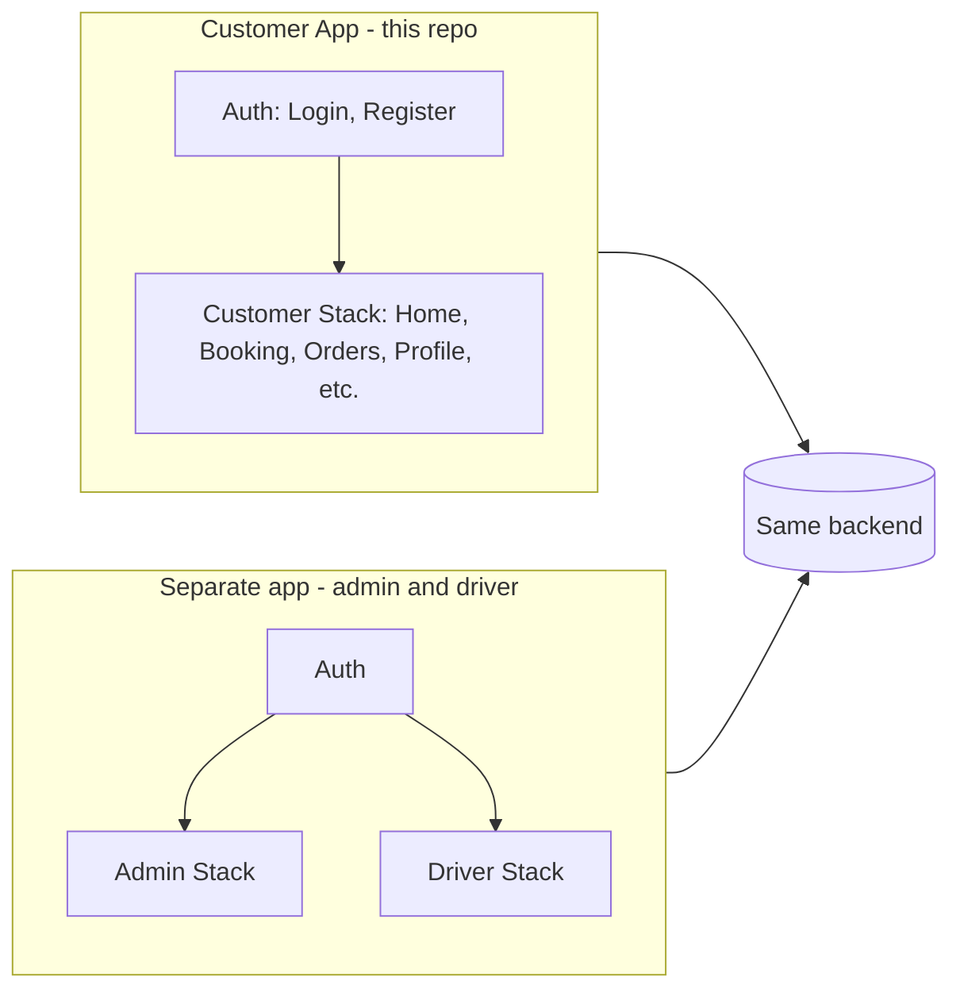

# Customer App Split – Documentation

## Purpose

This repository is the **customer-only** mobile app. It was split from a single app that previously supported three roles: customer, admin, and driver.

- **This repo:** Customer app only. Customers book tankers, view orders, track deliveries, and manage profile/addresses.
- **Separate app:** Admin and driver functionality lives in a different repository/app. That app uses the same backend and auth.
- **Backend:** Unchanged. Same Supabase/auth; no backend changes required for the split.

## Login Behavior

- **Backend login** is unchanged. This app uses the same auth API (e.g. Supabase).
- This app **always** uses `preferredRole: 'customer'` when logging in or registering. There is no role picker in the customer app.
- Users who have **multiple roles** (e.g. same account is both customer and admin) can log in here and will only see the **customer** experience. When they use the staff app, they log in with admin or driver role there.

---

## What Was Removed

- **Screens:** All of `src/screens/admin/` (AllBookingsScreen, DriverManagementScreen, VehicleManagementScreen, ReportsScreen, AdminProfileScreen, AddBankAccountScreen, ExpenseScreen) and all of `src/screens/driver/` (OrdersScreen, DriverEarningsScreen, CollectPaymentScreen). Auth: RoleEntryScreen.
- **Navigation:** DriverNavigator, AdminNavigator. Auth stack no longer includes RoleEntry; initial auth screen is Login.
- **Components:** All of `src/components/admin/` (StatusUpdateModal, ProfileHeader, EditProfileForm, DriverModal, DriverCard, BookingDetailsModal, BookingCard, AddDriverModal) and all of `src/components/driver/` (OrdersList, OrdersHeader, OrdersFilter, AmountInputModal). Common: AdminMenuDrawer, AdminIcon, DriverIcon.
- **Services:** ExpenseService (`expense.service.ts`), BankAccountService (`bankAccount.service.ts`) and their exports from `src/services/index.ts`.
- **Types:** AuthStackParamList no longer has RoleEntry; Login and Register have no `preferredRole` params (customer-only flow).
- **Tests:** Tests for removed screens/navigators/components (e.g. DriverNavigator, AdminNavigator, RoleEntryScreen, admin/driver component tests).

## What Was Kept

- **Screens:** All customer screens under `src/screens/customer/` (CustomerHomeScreen, BookingScreen, OrderTrackingScreen, OrderHistoryScreen, ProfileScreen, SavedAddressesScreen, PastOrdersScreen). Auth: LoginScreen, RegisterScreen.
- **Navigation:** AuthNavigator (Login, Register), CustomerNavigator (Home, Orders, Profile, Booking, OrderTracking, SavedAddresses, PastOrders). App root stack: Auth and Customer only.
- **Components:** All of `src/components/customer/` and common: CustomerMenuDrawer, CustomerIcon, Button, Input, Card, LoadingSpinner, Typography, ErrorBoundary.
- **Stores:** authStore, bookingStore, userStore (fetchUsersByRole for agencies, updateUser), vehicleStore.
- **Services:** AuthService, BookingService, PaymentService, LocationService, LocationTrackingService, UserService, VehicleService, StorageService, LocalStorageService.
- **Types:** CustomerUser, AdminUser (used for agency list in booking), DriverUser, UserRole, User union, and type guards (isCustomerUser, isAdminUser, isDriverUser) for backend/data-access compatibility. Booking, Address, and all shared domain types.
- **Utils/Lib:** reportCalculations, excelExport (used by PastOrdersScreen), and all other utils; supabaseDataAccess and supabaseClient unchanged.

## Navigation Structure

- **Root (App.tsx):** Two routes only: `Auth` | `Customer`. If user is logged in → `Customer`; otherwise → `Auth`.
- **Auth stack (AuthNavigator):** `Login` (initial) → `Register`. No role selection; login/register always use customer role.
- **Customer stack (CustomerNavigator):** Home, Orders, Profile, Booking, OrderTracking, SavedAddresses, PastOrders. Customer drawer/menu for in-app navigation.

## For the Second App (Admin + Driver)

The admin and driver app will have its own repo. It should:

- Reuse the **same backend** and auth (same Supabase project, same auth endpoints).
- Implement **Auth** (with role selection: Admin / Driver), **Admin** stack (bookings, drivers, vehicles, reports, profile, bank accounts, expenses), and **Driver** stack (orders, earnings, collect payment).
- You can copy Admin/Driver navigators, screens, and components from this repo’s **git history** (before the customer-only split) to bootstrap the second app.
