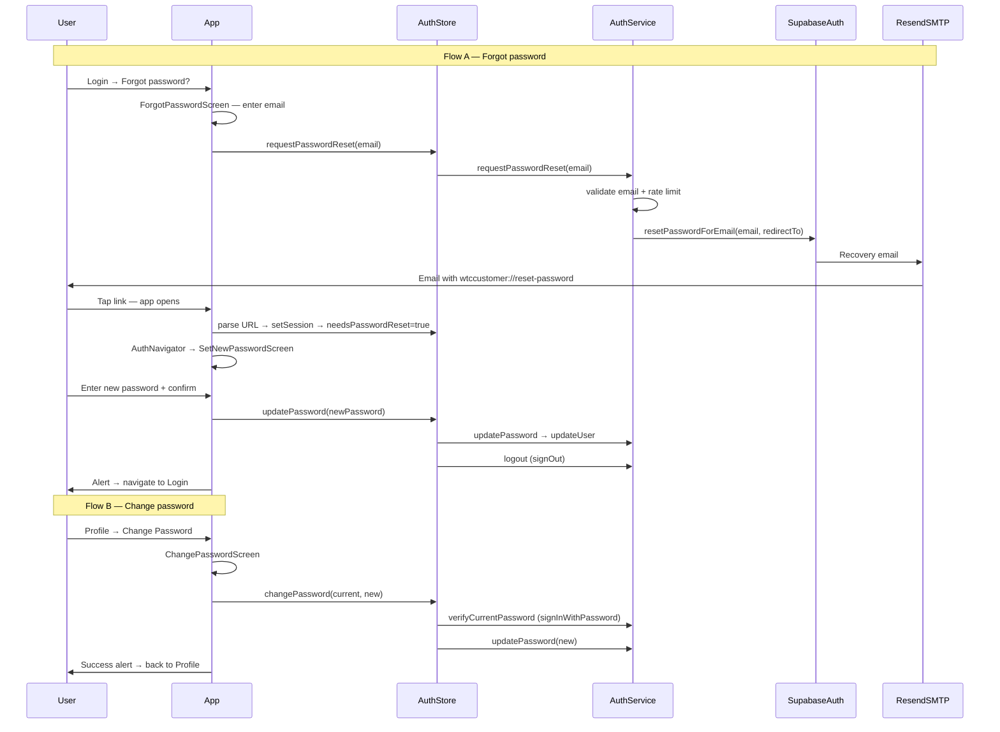

# Password Reset & Change Password — Customer App (As Built)

This document describes **how forgot-password and change-password are implemented in the customer app** (`water-customer-app`). Use it as a reference when adding the same flows to the **admin** and **driver** apps.

For a step-by-step build checklist, see [`PASSWORD_RESET_IMPLEMENTATION_GUIDE.md`](./PASSWORD_RESET_IMPLEMENTATION_GUIDE.md).

---

## Table of contents

1. [Overview — two flows](#overview--two-flows)
2. [End-to-end architecture](#end-to-end-architecture)
3. [Supabase & email (shared backend)](#supabase--email-shared-backend)
4. [Deep linking & environment](#deep-linking--environment)
5. [Service layer (`auth.service.ts`)](#service-layer-authservicets)
6. [State & recovery session (`authStore.ts`)](#state--recovery-session-authstorets)
7. [Recovery URL parsing (`recoveryLink.ts`)](#recovery-url-parsing-recoverylinkts)
8. [UI screens](#ui-screens)
9. [Navigation wiring](#navigation-wiring)
10. [Security & validation](#security--validation)
11. [Tests](#tests)
12. [Porting to admin & driver apps](#porting-to-admin--driver-apps)

---

## Overview — two flows

| Flow | User state | Email sent? | Where password is set |
|------|------------|-------------|------------------------|
| **A — Forgot password** | Not signed in | Yes — Supabase Auth sends recovery email via **Resend SMTP** | In-app on `SetNewPasswordScreen` after tapping the email deep link |
| **B — Change password** | Signed-in customer | No | In-app on `ChangePasswordScreen` from Profile |

### Design rules we follow

1. **No direct Resend API calls from the app** — Supabase Auth sends mail when `resetPasswordForEmail` is called. Resend is only the SMTP transport in the Supabase Dashboard.
2. **No email enumeration** — after forgot-password submit, we always show generic copy (“If an account exists…”).
3. **Client-side rate limiting** — `password_reset`: 3 requests per hour per email.
4. **Recovery completes in-app** — the reset link opens the mobile app via a custom URL scheme; there is no web reset page.
5. **Change password verifies current password** before calling `updateUser({ password })`.
6. **After forgot-password reset, user is signed out** — they must sign in again with the new password.

---

## End-to-end architecture



---

## Supabase & email (shared backend)

All three apps (customer, admin, driver) share the **same Supabase project**. Password reset is handled entirely by **Supabase Auth** — no custom Edge Function or Resend API integration in app code.

### Dashboard configuration (one-time, shared)

| Setting | Value |
|---------|--------|
| **Authentication → Email → SMTP** | Host `smtp.resend.com`, user `resend`, password = Resend API key, verified sender (e.g. `noreply@tankerhub.in`) |
| **Authentication → URL Configuration → Redirect URLs** | Add each app’s deep link, e.g. `wtccustomer://reset-password`, plus admin/driver schemes when those apps exist |
| **Authentication → Email Templates → Reset password** | Default `{{ .ConfirmationURL }}` link is correct |

### Supabase APIs used

| Action | Supabase method | When |
|--------|-----------------|------|
| Send reset email | `supabase.auth.resetPasswordForEmail(email, { redirectTo })` | Forgot password submit |
| Establish recovery session | `supabase.auth.setSession({ access_token, refresh_token })` | Deep link opened |
| Set new password | `supabase.auth.updateUser({ password })` | Set new password / change password |
| Verify current password | `supabase.auth.signInWithPassword({ email, password })` | Change password only |
| End recovery session | `supabase.auth.signOut()` | After forgot-password reset |

---

## Deep linking & environment

### Customer app values

| Item | Value |
|------|--------|
| Expo scheme | `wtccustomer` (`app.config.js`) |
| Redirect URL env | `EXPO_PUBLIC_PASSWORD_RESET_REDIRECT_URL=wtccustomer://reset-password` |
| Supabase allow-list | `wtccustomer://reset-password` |

### How the recovery link works

1. User submits email on `ForgotPasswordScreen`.
2. `AuthService.requestPasswordReset` calls Supabase with `redirectTo = getPasswordResetRedirectUrl()`.
3. Supabase sends an email whose link redirects to:
   ```
   wtccustomer://reset-password#access_token=...&refresh_token=...&type=recovery
   ```
4. OS opens the customer app. Tokens are in the **URL hash** (fragment), not query params.
5. App parses the hash, calls `setSession`, and sets `needsPasswordReset: true`.

### Files involved

| File | Role |
|------|------|
| `app.config.js` | `scheme: 'wtccustomer'`, exposes `passwordResetRedirectUrl` in `extra` |
| `.env.example` | Documents `EXPO_PUBLIC_PASSWORD_RESET_REDIRECT_URL` |
| `src/utils/recoveryLink.ts` | `parseRecoveryTokensFromUrl`, `getPasswordResetRedirectUrl` |

---

## Service layer (`auth.service.ts`)

Three static methods power both flows:

### `requestPasswordReset(email)`

```typescript
// src/services/auth.service.ts (simplified)
static async requestPasswordReset(email: string): Promise<AuthResult> {
  // 1. Sanitize + validate email
  // 2. rateLimiter.isAllowed('password_reset', email) — 3/hour
  // 3. rateLimiter.record('password_reset', email)
  // 4. supabase.auth.resetPasswordForEmail(email, { redirectTo: getPasswordResetRedirectUrl() })
  // 5. Map Supabase rate-limit errors to friendly copy
}
```

- Returns `{ success: true }` when Supabase accepts the request (we do **not** leak whether the email exists).
- Returns `{ success: false, error }` for validation failures, client rate limit, or Supabase errors.

### `updatePassword(newPassword, userId?)`

```typescript
static async updatePassword(newPassword: string, userId?: string): Promise<AuthResult> {
  // 1. ValidationUtils.validatePassword(newPassword)
  // 2. securityLogger: PASSWORD_CHANGE_ATTEMPT / SUCCESS / FAILURE
  // 3. supabase.auth.updateUser({ password: newPassword })
}
```

Used by:
- **Forgot-password flow** — session was created from recovery tokens.
- **Change-password flow** — user is already signed in; optional `userId` for security logging.

### `verifyCurrentPassword(email, password)`

```typescript
static async verifyCurrentPassword(email: string, password: string): Promise<AuthResult> {
  // 1. Validate email + password
  // 2. supabase.auth.signInWithPassword({ email, password })
  // 3. On failure → generic "Invalid email address or password" (no hint which field is wrong)
}
```

Only used for **change password from Profile**, not for forgot-password.

---

## State & recovery session (`authStore.ts`)

### Key state

| Field | Type | Purpose |
|-------|------|---------|
| `needsPasswordReset` | `boolean` | True when session is from a recovery link; drives navigation to `SetNewPassword` |
| `requestPasswordReset` | `(email) => Promise` | Wraps `AuthService.requestPasswordReset`; throws on failure |
| `updatePassword` | `(newPassword) => Promise` | Updates password, then **signs out** and clears auth state |
| `changePassword` | `(current, new) => Promise` | Verifies current password, updates, **keeps session** |
| `clearNeedsPasswordReset` | `() => void` | Clears the recovery flag |

### Recovery deep link handling

Two entry points set `needsPasswordReset: true`:

1. **Cold start** — `initializeAuth()` calls `Linking.getInitialURL()` when there is no existing session, then `applyRecoverySessionFromUrl`.
2. **Warm start** — `Linking.addEventListener('url', …)` registered in `subscribeToRecoveryDeepLinks` (via `subscribeToAuthChanges`).

`applyRecoverySessionFromUrl`:

```typescript
// src/store/authStore.ts (simplified)
const tokens = parseRecoveryTokensFromUrl(url);
if (!tokens) return false;

await supabase.auth.setSession({
  access_token: tokens.access_token,
  refresh_token: tokens.refresh_token,
});

set({
  user: null,
  isAuthenticated: false,
  needsPasswordReset: true,
  // ...clear other flags
});
```

### `onAuthStateChange` — `PASSWORD_RECOVERY` event

Supabase may also emit `PASSWORD_RECOVERY` when the recovery session is established:

```typescript
if (event === 'PASSWORD_RECOVERY' && session?.user) {
  set({
    user: null,
    isAuthenticated: false,
    needsPasswordReset: true,
    // ...
  });
  return; // Do not fetch profile — user must set password first
}
```

### `updatePassword` vs `changePassword`

| Method | After success | Session |
|--------|---------------|---------|
| `updatePassword` | Calls `AuthService.logout()`, clears `user`, `needsPasswordReset`, etc. | Ended — user goes to Login |
| `changePassword` | Only sets `isLoading: false` | Preserved — user stays on Profile |

---

## Recovery URL parsing (`recoveryLink.ts`)

```typescript
// Expected URL shape:
// wtccustomer://reset-password#access_token=...&refresh_token=...&type=recovery

export function parseRecoveryTokensFromUrl(url: string): RecoveryTokens | null {
  const hashIndex = url.indexOf('#');
  if (hashIndex === -1) return null;
  // Parse fragment key=value pairs
  // Return null unless access_token, refresh_token, and type === 'recovery'
}

export function getPasswordResetRedirectUrl(): string {
  return process.env.EXPO_PUBLIC_PASSWORD_RESET_REDIRECT_URL || 'wtccustomer://reset-password';
}
```

---

## UI screens

### 1. `ForgotPasswordScreen` (`src/screens/auth/ForgotPasswordScreen.tsx`)

**Entry:** “Forgot password?” on `LoginScreen` and `SocietyLoginScreen`.

| Concern | Implementation |
|---------|----------------|
| Route param | `{ accountKind?: 'individual' \| 'society' }` — used only for back navigation to the correct login screen |
| Form | Single email field with `ValidationUtils.validateEmail` |
| Submit | `useAuthStore().requestPasswordReset(email)` |
| Success UI | Switches to “Check your email” state with generic message from `SUCCESS_MESSAGES.auth.forgotPasswordSentMessage` |
| Errors | `Alert.alert` with server/rate-limit message |

### 2. `SetNewPasswordScreen` (`src/screens/auth/SetNewPasswordScreen.tsx`)

**Entry:** Shown when `needsPasswordReset === true` (deep link or `PASSWORD_RECOVERY` event).

| Concern | Implementation |
|---------|----------------|
| Fields | New password + confirm (show/hide toggles) |
| Validation | `ValidationUtils.validatePassword`, `validateConfirmPassword` |
| Submit | `useAuthStore().updatePassword(password)` |
| After success | Alert with `setNewPasswordSuccess` → navigate to Login or SocietyLogin based on `customerAccountKind` |
| Back | Same sign-in navigation as success |

### 3. `ChangePasswordScreen` (`src/screens/customer/ChangePasswordScreen.tsx`)

**Entry:** Profile → “Change Password” action.

| Concern | Implementation |
|---------|----------------|
| Fields | Current password, new password, confirm |
| Extra rule | New password must differ from current |
| Submit | `useAuthStore().changePassword(currentPassword, newPassword)` |
| Logging | `securityLogger` with context `profile_change_password` |
| After success | Alert → `navigation.goBack()` to Profile |
| Layout | `AppScreenHeader` + `SafeAreaView` (main app stack, not auth layout) |

### Copy constants

All user-facing strings live in `src/constants/config.ts` under `SUCCESS_MESSAGES.auth` and `ERROR_MESSAGES.auth`:

- `forgotPasswordTitle`, `forgotPasswordSentMessage`, …
- `setNewPasswordTitle`, `setNewPasswordSuccess`, …
- `changePasswordSubtitle`, `changePasswordSubmit`, …
- `profile.passwordChanged` (success alert on Profile flow)

---

## Navigation wiring

### Auth stack (`AuthNavigator.tsx`)

```typescript
const needsPasswordReset = useAuthStore((s) => s.needsPasswordReset);

<Stack.Navigator
  key={needsPasswordReset ? 'password-reset' : 'auth-default'}
  initialRouteName={needsPasswordReset ? 'SetNewPassword' : 'RoleSelection'}
>
  {/* ... */}
  <Stack.Screen name="ForgotPassword" component={ForgotPasswordScreen} />
  <Stack.Screen name="SetNewPassword" component={SetNewPasswordScreen} />
</Stack.Navigator>
```

- Remounting the navigator with a new `key` when `needsPasswordReset` flips ensures `SetNewPassword` becomes the initial route.
- `ForgotPassword` is reached from login screens via `navigation.navigate('ForgotPassword', { accountKind })`.

### Root stack (`App.tsx`)

```typescript
const getInitialRouteName = (user, needsPasswordReset) => {
  if (needsPasswordReset) return 'Auth';  // Auth stack shows SetNewPassword
  if (!currentUser) return 'Auth';
  if (isCustomerUser(currentUser)) return 'Main';
  return 'Auth';
};
```

When `needsPasswordReset` is true, the root navigator always routes to `Auth` (even if a partial session exists).

### Main stack (`MainNavigator.tsx`)

```typescript
<Stack.Screen name="ChangePassword" component={ChangePasswordScreen} />
```

Registered in `AppStackParamList` / `rootNavigation.ts` as `ChangePassword: undefined`.

### Type definitions (`src/types/index.ts`)

```typescript
export type AuthStackParamList = {
  // ...
  ForgotPassword: { accountKind?: CustomerAccountKind };
  SetNewPassword: undefined;
};
```

---

## Security & validation

### Rate limiting (`src/utils/rateLimiter.ts`)

```typescript
['password_reset', { maxRequests: 3, windowMs: 60 * 60 * 1000 }] // 3 per hour
```

Checked in `AuthService.requestPasswordReset` before calling Supabase.

### Password rules (`ValidationUtils.validatePassword`)

Uses `VALIDATION_CONFIG.password.minLength` (minimum character length). Confirm field must match via `validateConfirmPassword`.

### Security logging

| Event | Where |
|-------|--------|
| `PASSWORD_CHANGE_ATTEMPT` | `AuthService.updatePassword`, `ChangePasswordScreen` submit |
| `PASSWORD_CHANGE_SUCCESS` | After successful update |
| `PASSWORD_CHANGE_FAILURE` | On Supabase or verification errors |

### Session hygiene after forgot-password reset

`authStore.updatePassword` always calls `AuthService.logout()` so the recovery session cannot be reused. User must sign in with the new password.

---

## Tests

| File | Coverage |
|------|----------|
| `src/__tests__/services/auth.password.test.ts` | `requestPasswordReset`, `updatePassword`, `verifyCurrentPassword`, `parseRecoveryTokensFromUrl`, client rate limit |
| `src/__tests__/navigation/navigation.test.tsx` | Mocks for `ForgotPasswordScreen`, `SetNewPasswordScreen`, `ChangePasswordScreen` |
| `scripts/test-general-auth.ts` | Smoke check that `requestPasswordReset` exists and `password_reset` rate limit config is present |

Run password tests:

```bash
npm test -- src/__tests__/services/auth.password.test.ts
```

---

## Porting to admin & driver apps

The **logic is identical** across apps; only **app-specific identifiers** and **navigation entry points** change. All apps share the same Supabase Auth users — a password reset works for any role.

### Per-app checklist

| Step | Customer (done) | Admin / driver (to do) |
|------|-----------------|------------------------|
| **1. Expo scheme** | `wtccustomer` | e.g. `wtcadmin`, `wtcdriver` — unique per app |
| **2. Env var** | `EXPO_PUBLIC_PASSWORD_RESET_REDIRECT_URL=wtccustomer://reset-password` | `wtcadmin://reset-password`, `wtcdriver://reset-password` |
| **3. Supabase redirect allow-list** | `wtccustomer://reset-password` | Add each new URL in Dashboard |
| **4. Rebuild dev client** | After `app.config.js` scheme change | Required for deep links to work |
| **5. Copy shared code** | — | `recoveryLink.ts` (update default fallback URL), auth service methods, authStore recovery logic |
| **6. Auth screens** | `ForgotPasswordScreen`, `SetNewPasswordScreen` | Reuse or copy; adjust back-navigation (admin/driver may not have society vs individual) |
| **7. Login entry** | “Forgot password?” on login screens | Add link on admin/driver login |
| **8. Change password entry** | Profile → Change Password | Admin/driver Profile or Settings screen |
| **9. Root routing** | `needsPasswordReset → Auth` | Same pattern; role gate differs (`isAdminUser` / `isDriverUser` instead of `isCustomerUser`) |
| **10. Copy strings** | `config.ts` auth messages | Copy or share constants package |

### What you can copy verbatim

- `src/utils/recoveryLink.ts` — change default fallback URL to match the app scheme
- `AuthService.requestPasswordReset`, `updatePassword`, `verifyCurrentPassword`
- `authStore` recovery helpers: `applyRecoverySessionFromUrl`, `subscribeToRecoveryDeepLinks`, `needsPasswordReset` handling, `PASSWORD_RECOVERY` listener
- Screen UI patterns from `ForgotPasswordScreen`, `SetNewPasswordScreen`, `ChangePasswordScreen`
- Rate limit key `password_reset` (same limits per email across apps is fine)

### What to adapt per app

| Area | Customer-specific | Admin/driver adjustment |
|------|-------------------|-------------------------|
| Deep link scheme | `wtccustomer://reset-password` | App-specific scheme + env var |
| `ForgotPasswordScreen` back nav | `accountKind` → Login vs SocietyLogin | Single login screen (likely) |
| `SetNewPasswordScreen` back nav | Uses `customerAccountKind` | Navigate to that app’s login screen |
| `App.tsx` route guard | `isCustomerUser` → Main | `isAdminUser` / `isDriverUser` → Main |
| Change password location | `ProfileScreen` | Admin/driver profile or settings |
| Auth stack initial route | `RoleSelection` when not resetting | May be `Login` directly if no role picker |

### Supabase redirect URLs (example when all three apps exist)

```
wtccustomer://reset-password
wtcadmin://reset-password
wtcdriver://reset-password
```

Each app passes its own URL as `redirectTo` in `resetPasswordForEmail`. Supabase validates against the allow-list.

### Minimal file list to implement in a new app

| Action | File |
|--------|------|
| Create / copy | `src/utils/recoveryLink.ts` |
| Extend | `src/services/auth.service.ts` — add three password methods |
| Extend | `src/store/authStore.ts` — recovery deep links + store actions |
| Create | `src/screens/auth/ForgotPasswordScreen.tsx` |
| Create | `src/screens/auth/SetNewPasswordScreen.tsx` |
| Create | `src/screens/<role>/ChangePasswordScreen.tsx` |
| Modify | `src/navigation/AuthNavigator.tsx` |
| Modify | Main navigator + Profile/Settings |
| Modify | Login screen(s) — forgot password link |
| Modify | `App.tsx` — `needsPasswordReset` in route selection |
| Modify | `app.config.js` — `scheme` + env |
| Modify | `.env.example` |
| Modify | `src/constants/config.ts` — copy strings |
| Modify | `src/types/index.ts` — auth stack params |
| Create | `src/__tests__/services/auth.password.test.ts` |

### Verification after porting

1. **Forgot password:** Submit email → receive mail → tap link → app opens on Set New Password → set password → signed out → login with new password works.
2. **Change password:** Signed in → Profile/Settings → change password → current password wrong shows generic error → success keeps session.
3. **Rate limit:** Fourth reset request within an hour shows client rate-limit message.
4. **Deep link while app open:** Send reset email, tap link with app in background → navigates to Set New Password.

---

## Quick reference — file map (customer app)

| Layer | Files |
|-------|--------|
| Utils | `src/utils/recoveryLink.ts`, `src/utils/rateLimiter.ts`, `src/utils/validation.ts` |
| Service | `src/services/auth.service.ts` |
| Store | `src/store/authStore.ts` |
| Screens | `src/screens/auth/ForgotPasswordScreen.tsx`, `SetNewPasswordScreen.tsx`, `src/screens/customer/ChangePasswordScreen.tsx` |
| Navigation | `src/navigation/AuthNavigator.tsx`, `MainNavigator.tsx`, `App.tsx` |
| Config | `app.config.js`, `.env.example`, `src/constants/config.ts` |
| Types | `src/types/index.ts`, `src/navigation/rootNavigation.ts` |
| Tests | `src/__tests__/services/auth.password.test.ts` |

---

## Related docs

- [`PASSWORD_RESET_IMPLEMENTATION_GUIDE.md`](./PASSWORD_RESET_IMPLEMENTATION_GUIDE.md) — phased build checklist used during initial implementation
- Supabase: [Password-based Auth](https://supabase.com/docs/guides/auth/passwords), [Redirect URLs](https://supabase.com/docs/guides/auth/redirect-urls)
