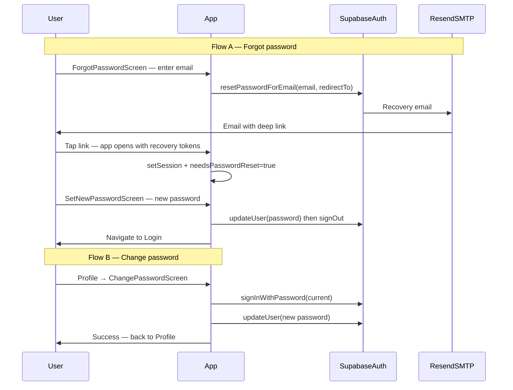

# Password Reset & Change Password — Customer App Implementation Guide

You are implementing **forgot password** (email via Supabase Auth + Resend SMTP) and **change password from Profile** in the **React Native + Expo customer app** for TankerHub.

---

## Table of contents

1. [Overview — two password flows](#overview--two-password-flows)
2. [Current repo state](#current-repo-state)
3. [Prerequisites checklist](#prerequisites-checklist)
4. [Phase 0 — Supabase & Resend (Dashboard)](#phase-0--supabase--resend-dashboard)
5. [Phase 1 — Deep linking & environment](#phase-1--deep-linking--environment)
6. [Phase 2 — Auth service layer](#phase-2--auth-service-layer)
7. [Phase 3 — Forgot password UI](#phase-3--forgot-password-ui)
8. [Phase 4 — In-app reset password (recovery)](#phase-4--in-app-reset-password-recovery)
9. [Phase 5 — Change password from Profile](#phase-5--change-password-from-profile)
10. [Phase 6 — Tests, security & polish](#phase-6--tests-security--polish)
11. [Reference — files, env vars, diagrams](#reference--files-env-vars-diagrams)

---

## Overview — two password flows

| Flow | Who | Email sent? | Where password is set |
|------|-----|-------------|------------------------|
| **A — Forgot password** | User not signed in | Yes — Supabase Auth sends recovery email via **Resend SMTP** | **In the mobile app** (`SetNewPasswordScreen`) after deep link |
| **B — Change password** | Signed-in customer | No | **In the mobile app** (`ChangePasswordScreen` from Profile) |

### Non-negotiable rules

1. **Do not call Resend API from the app** — Supabase Auth sends mail when you call `resetPasswordForEmail`. Resend is only the SMTP transport configured in Supabase Dashboard.
2. **Do not reveal whether an email exists** — always show a generic “If an account exists…” message after forgot-password submit.
3. **Rate limit** forgot-password requests client-side (`password_reset`: 3/hour per email).
4. **Recovery completes in-app** — deep link opens the app; no web reset page required.
5. **Change password verifies current password** before calling `updateUser({ password })`.



---

## Current repo state

| Area | Status |
|------|--------|
| Login / signup | Done — `LoginScreen`, `SocietyLoginScreen`, `RegisterScreen` |
| Forgot password UI | Implemented — `ForgotPasswordScreen` |
| Recovery session | Implemented — `authStore.needsPasswordReset`, deep link parser, `SetNewPasswordScreen` |
| Change password | Implemented — `ChangePasswordScreen` from Profile |
| Auth service | `requestPasswordReset`, `updatePassword`, `verifyCurrentPassword` |
| Rate limiting | `password_reset` in `rateLimiter.ts` |
| Deep linking | `scheme: wtccustomer` in `app.config.js` |

---

## Prerequisites checklist

- [ ] Supabase project with Email auth enabled
- [ ] Resend domain verified; SMTP configured in Supabase (Authentication → Email → SMTP)
- [ ] Redirect URL `wtccustomer://reset-password` added to Supabase Auth URL allow-list
- [ ] `.env` contains `EXPO_PUBLIC_PASSWORD_RESET_REDIRECT_URL=wtccustomer://reset-password`
- [ ] Rebuild dev client after changing `app.config.js` scheme (Expo)

---

## Phase 0 — Supabase & Resend (Dashboard)

**No app code.** Configure in Supabase Dashboard:

1. **Authentication → Email → SMTP**
   - Host: `smtp.resend.com`
   - Port: `465` (SSL) or `587` (TLS)
   - Username: `resend`
   - Password: your Resend API key
   - Sender: verified address (e.g. `noreply@tankerhub.in`)

2. **Authentication → URL Configuration → Redirect URLs**
   - `wtccustomer://reset-password`
   - `https://tankerhub.in/auth/success` (signup verification — existing)

3. **Authentication → Email Templates → Reset password**
   - Ensure link uses `{{ .ConfirmationURL }}` (default)

4. **Optional:** Authentication → Email → Secure password change — align with product (local `supabase/config.toml` uses `secure_password_change = false`).

**Verify:** Dashboard → Users → Send password recovery for a test user; confirm email arrives via Resend.

---

## Phase 1 — Deep linking & environment

### Environment

```env
EXPO_PUBLIC_PASSWORD_RESET_REDIRECT_URL=wtccustomer://reset-password
```

### `app.config.js`

- Add `scheme: 'wtccustomer'`
- Expose redirect URL in `extra` if needed at runtime

### `src/utils/recoveryLink.ts`

- Parse URL hash for `access_token`, `refresh_token`, `type=recovery`

### `src/store/authStore.ts`

- Reuse parser on cold start (`Linking.getInitialURL`) and warm start (`Linking.addEventListener('url', …)`)
- On success: `supabase.auth.setSession` → `needsPasswordReset: true`

### Supabase

- Register `wtccustomer://reset-password` in redirect allow-list

---

## Phase 2 — Auth service layer

Add to `src/services/auth.service.ts`:

| Method | Supabase API | Notes |
|--------|--------------|-------|
| `getPasswordResetRedirectUrl()` | — | Reads env, default `wtccustomer://reset-password` |
| `requestPasswordReset(email)` | `auth.resetPasswordForEmail` | Rate limit `password_reset`; generic success |
| `updatePassword(newPassword)` | `auth.updateUser({ password })` | Validates password length |
| `verifyCurrentPassword(email, password)` | `auth.signInWithPassword` | For Profile change only |

Wire in `authStore`: `requestPasswordReset`, `updatePassword`, `changePassword(current, new)`.

Add copy in `src/constants/config.ts` under `SUCCESS_MESSAGES.auth` and `ERROR_MESSAGES.auth`.

---

## Phase 3 — Forgot password UI

### New screen: `src/screens/auth/ForgotPasswordScreen.tsx`

- Email input → `requestPasswordReset`
- Success: “Check your email” (pattern from `VerifyEmailScreen`)
- Route param: `{ accountKind?: 'individual' | 'society' }` for back navigation

### Navigation

- `AuthStackParamList`: `ForgotPassword`, `SetNewPassword`
- Register in `AuthNavigator.tsx`

### Login screens

- Remove “Reset password is not available yet” notice
- Add “Forgot password?” link → `ForgotPassword` with correct `accountKind`

---

## Phase 4 — In-app reset password (recovery)

### New screen: `src/screens/auth/SetNewPasswordScreen.tsx`

- New password + confirm (reuse RegisterScreen input pattern)
- Submit → `updatePassword` → `signOut` → `clearNeedsPasswordReset` → Login with success alert

### Routing

- `AuthNavigator`: `initialRouteName="SetNewPassword"` when `needsPasswordReset === true`
- `useEffect` navigates to `SetNewPassword` when flag becomes true (deep link while app open)

---

## Phase 5 — Change password from Profile

### New screen: `src/screens/customer/ChangePasswordScreen.tsx`

- Current password, new password, confirm
- Flow: validate → `verifyCurrentPassword` → `updatePassword`
- Log `PASSWORD_CHANGE_*` via `securityLogger`

### Profile

- “Change Password” action between Edit Profile and Contact Us

### Main stack

- `ChangePassword: undefined` in `AppStackParamList` + `MainNavigator`

---

## Phase 6 — Tests, security & polish

- Unit tests: `src/__tests__/services/auth.password.test.ts` (mirror `auth.resend.test.ts`)
- Update `scripts/test-general-auth.ts` — expect `requestPasswordReset` to exist
- Navigation tests for new routes (optional smoke)
- Security checklist:
  - [ ] Generic forgot-password response (no email enumeration)
  - [ ] Client rate limits enforced
  - [ ] Recovery session cleared after reset (`signOut`)
  - [ ] Current password verified before Profile change

---

## Reference — files, env vars, diagrams

### Files created / modified

| Action | File |
|--------|------|
| Create | `docs/PASSWORD_RESET_IMPLEMENTATION_GUIDE.md` |
| Create | `src/utils/recoveryLink.ts` |
| Create | `src/screens/auth/ForgotPasswordScreen.tsx` |
| Create | `src/screens/auth/SetNewPasswordScreen.tsx` |
| Create | `src/screens/customer/ChangePasswordScreen.tsx` |
| Create | `src/__tests__/services/auth.password.test.ts` |
| Modify | `src/services/auth.service.ts` |
| Modify | `src/store/authStore.ts` |
| Modify | `src/navigation/AuthNavigator.tsx` |
| Modify | `src/navigation/MainNavigator.tsx` |
| Modify | `src/navigation/rootNavigation.ts` |
| Modify | `src/types/index.ts` |
| Modify | `App.tsx` |
| Modify | `app.config.js` |
| Modify | `src/screens/auth/LoginScreen.tsx`, `SocietyLoginScreen.tsx` |
| Modify | `src/screens/customer/ProfileScreen.tsx` |
| Modify | `src/constants/config.ts` |
| Modify | `.env.example` |
| Modify | `scripts/test-general-auth.ts` |

### Environment variables

| Variable | Example | Purpose |
|----------|---------|---------|
| `EXPO_PUBLIC_PASSWORD_RESET_REDIRECT_URL` | `wtccustomer://reset-password` | `redirectTo` for recovery emails |
| `EXPO_PUBLIC_AUTH_SUCCESS_URL` | `https://tankerhub.in/auth/success` | Signup verification (existing) |

### Out of scope

- Custom Resend API / Edge Function for mail
- Web-based reset page (`reset-password.html`)
- Password-changed notification email (optional Dashboard toggle)
- Admin / driver apps

### Recommended order

Phase 0 → 1 → 2 → 3 → 4 → 5 → 6
