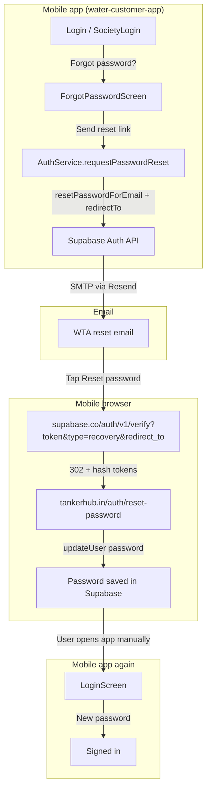
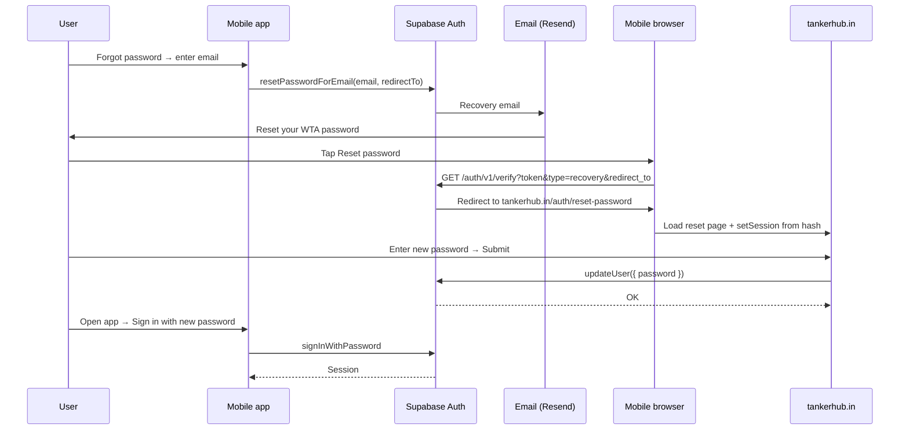

# Password Reset — Routing Flow

This document explains **how routing works** when a customer resets their password: from the mobile app screen, through the recovery email, to the web reset page. It matches the flow shown in the three reference screens below.

For implementation details (services, state, tests), see [`PASSWORD_RESET_AND_CHANGE_PASSWORD.md`](./PASSWORD_RESET_AND_CHANGE_PASSWORD.md).

---

## Table of contents

1. [At a glance](#at-a-glance)
2. [Step 1 — Mobile app: request reset (Image 1)](#step-1--mobile-app-request-reset-image-1)
3. [Step 2 — Email link (Image 2)](#step-2--email-link-image-2)
4. [Step 3 — Web reset page (Image 3)](#step-3--web-reset-page-image-3)
5. [Step 4 — Return to the mobile app](#step-4--return-to-the-mobile-app)
6. [Full routing diagram](#full-routing-diagram)
7. [URL anatomy](#url-anatomy)
8. [Configuration that controls routing](#configuration-that-controls-routing)
9. [Alternative: in-app deep link routing](#alternative-in-app-deep-link-routing)

---

## At a glance

| Step | Where | What the user sees | What happens technically |
|------|--------|--------------------|---------------------------|
| **1** | Mobile app | “Reset your password” — enter email, tap **Send reset link** | App calls Supabase Auth to send a recovery email |
| **2** | Email (Gmail, etc.) | “Reset your WTA password” with a **Reset password** button | Link points to Supabase verify endpoint with a `redirect_to` target |
| **3** | Mobile browser | `tankerhub.in` — “Reset password” form | Supabase verifies token, redirects to web page with session tokens |
| **4** | Mobile app again | Sign-in screen | User signs in manually with the new password |

**Important:** Steps 1 and 4 happen in the **customer mobile app** (`water-customer-app`). Step 3 happens on the **TankerHub website** (`https://tankerhub.in/auth/reset-password`), which is hosted outside this repo. The email (step 2) is sent by **Supabase Auth** via **Resend SMTP**.

---

## Step 1 — Mobile app: request reset (Image 1)

### Screen

- **Title:** Reset your password  
- **Subtitle:** Enter the email for your account and we will send you a reset link.  
- **Action:** Send reset link  

This is `ForgotPasswordScreen` in the auth stack.

### Navigation path (in-app routing)

```
RoleSelection
  └─ Login (or SocietyLogin)
       └─ "Forgot password?" tap
            └─ ForgotPassword  ← Image 1
```

| Entry point | Navigation call |
|-------------|-----------------|
| Individual login | `LoginScreen` → `navigation.navigate('ForgotPassword', { accountKind: 'individual' })` |
| Society login | `SocietyLoginScreen` → `navigation.navigate('ForgotPassword', { accountKind: 'society' })` |

Back navigation from `ForgotPassword` returns to the correct login screen based on `accountKind`.

### Code path when user taps “Send reset link”

```
ForgotPasswordScreen.handleSubmit()
  → useAuthStore.requestPasswordReset(email)
    → AuthService.requestPasswordReset(email)
      → validate email
      → client rate limit (3 requests / hour per email)
      → supabase.auth.resetPasswordForEmail(email, { redirectTo })
```

| Layer | File | Responsibility |
|-------|------|----------------|
| UI | `src/screens/auth/ForgotPasswordScreen.tsx` | Form, validation display, success state |
| State | `src/store/authStore.ts` | `requestPasswordReset` wrapper |
| Service | `src/services/auth.service.ts` | Supabase API call |
| Redirect URL | `src/utils/recoveryLink.ts` | `getPasswordResetRedirectUrl()` |

### `redirectTo` sent to Supabase

The app passes a **`redirectTo`** URL when requesting the reset email. Supabase embeds this in the email link as the `redirect_to` query parameter (see step 2).

```typescript
// src/utils/recoveryLink.ts
export function getPasswordResetRedirectUrl(): string {
  return (
    process.env.EXPO_PUBLIC_PASSWORD_RESET_REDIRECT_URL ||
    'wtccustomer://reset-password'
  );
}
```

**In production (as shown in Image 2),** the email uses:

```
redirect_to=https://tankerhub.in/auth/reset-password
```

That means the deployed app (or Supabase project configuration) is using the **web URL** as `redirectTo`, not the default deep link. See [Configuration that controls routing](#configuration-that-controls-routing).

### After submit (still on Image 1 flow)

On success, the screen switches to a “Check your email” state. The user stays in the app until they open the email.

---

## Step 2 — Email link (Image 2)

### Screen

- **From:** WTA  
- **Subject:** Reset your WTA password  
- **Body:** “Reset your password” with a **Reset password** button  
- **Fallback:** Plain-text link for copy/paste  

The email is **not** generated by the mobile app. Supabase Auth builds it from the **Reset password** email template and sends it through configured SMTP (Resend).

### Link structure (from Image 2)

When the user taps **Reset password**, the device opens a URL like:

```
https://<project-ref>.supabase.co/auth/v1/verify
  ?token=<one-time-recovery-token>
  &type=recovery
  &redirect_to=https%3A%2F%2Ftankerhub.in%2Fauth%2Freset-password
```

| Parameter | Purpose |
|-----------|---------|
| `token` | One-time recovery token Supabase validates |
| `type=recovery` | Tells Supabase this is a password-reset flow (not signup confirmation) |
| `redirect_to` | Where the browser goes **after** Supabase verifies the token |

Decoded `redirect_to`:

```
https://tankerhub.in/auth/reset-password
```

### Routing at this hop

```
User taps email link
  → Mobile OS opens default browser (Safari / Chrome)
    → GET https://<project>.supabase.co/auth/v1/verify?...
      → Supabase validates token
        → HTTP 302 redirect to redirect_to + session in URL hash
```

Supabase does **not** send the user straight to `tankerhub.in` in one step. The browser always hits **`/auth/v1/verify` first**, then Supabase redirects to `redirect_to`.

---

## Step 3 — Web reset page (Image 3)

### Screen

- **URL:** `https://tankerhub.in/auth/reset-password` (shown in the browser address bar)  
- **Site:** Water Tanker / TankerHub marketing site  
- **Form:** New password + Confirm new password → **Submit**  
- **Copy:** “After updating, you can return to the mobile app and sign in again with your new password.”  

This page is **not** part of `water-customer-app`. It lives on the TankerHub website repo / deployment.

### How the user lands here

After Supabase verifies the token in step 2, the browser is redirected to:

```
https://tankerhub.in/auth/reset-password#access_token=...&refresh_token=...&type=recovery
```

| Part of URL | Role |
|-------------|------|
| Path `/auth/reset-password` | Web route that renders the reset form |
| Hash `#access_token=...&refresh_token=...&type=recovery` | Supabase recovery session (not sent to the server; read by client-side JS) |

The web page typically:

1. Parses tokens from the URL hash  
2. Calls `supabase.auth.setSession({ access_token, refresh_token })`  
3. Shows the password form when the recovery session is valid  
4. On **Submit**, calls `supabase.auth.updateUser({ password: newPassword })`  
5. Shows success and instructs the user to return to the app  

### Routing at this hop

```
Browser loads tankerhub.in/auth/reset-password#tokens...
  → Web app JS reads hash fragment
    → supabase.auth.setSession(...)
      → User enters new password
        → supabase.auth.updateUser({ password })
          → Password updated in Supabase Auth (shared across all apps)
```

The mobile app is **not** opened automatically at this step. Reset completes entirely in the **mobile browser**.

---

## Step 4 — Return to the mobile app

There is **no automatic deep link** back into the app in the web-based flow shown in the screenshots.

```
User switches to WTC app manually
  → Login or SocietyLogin
    → signInWithPassword(email, newPassword)
      → Normal authenticated session
```

The web page copy explicitly tells the user to return to the mobile app and sign in again.

---

## Full routing diagram



### Sequence view



---

## URL anatomy

### 1. Supabase verify URL (in email)

```
https://ajdcmqbljypgvbhkiwvw.supabase.co/auth/v1/verify
  ?token=<opaque-token>
  &type=recovery
  &redirect_to=<url-encoded-final-destination>
```

- **Host:** Your Supabase project (`EXPO_PUBLIC_SUPABASE_URL` without trailing path)  
- **Path:** `/auth/v1/verify` — Supabase’s token verification endpoint  
- **Never skip this hop** — it exchanges the email token for session tokens  

### 2. Final redirect URL (after verify)

```
https://tankerhub.in/auth/reset-password#access_token=...&refresh_token=...&type=recovery
```

- **Path:** Web app route on TankerHub  
- **Hash:** Recovery session; required for `updateUser` on the web page  

### 3. What the app sends as `redirectTo`

| Environment | Typical `redirectTo` | Where password is set |
|-------------|----------------------|------------------------|
| **Production (screenshots)** | `https://tankerhub.in/auth/reset-password` | Web browser |
| **Default in repo** | `wtccustomer://reset-password` | In-app `SetNewPasswordScreen` |

Both URLs must be listed in **Supabase Dashboard → Authentication → URL Configuration → Redirect URLs**.

---

## Configuration that controls routing

| Setting | Location | Effect on routing |
|---------|----------|-------------------|
| `EXPO_PUBLIC_PASSWORD_RESET_REDIRECT_URL` | App `.env` / EAS secrets | Passed as `redirectTo` to `resetPasswordForEmail`; becomes `redirect_to` in the email link |
| **Redirect URLs allow-list** | Supabase Dashboard | Supabase rejects redirects not on the list |
| **Site URL** | Supabase Dashboard | Fallback if `redirectTo` is missing or invalid |
| **Reset password email template** | Supabase Dashboard | Uses `{{ .ConfirmationURL }}` — includes verify URL + `redirect_to` |
| **SMTP (Resend)** | Supabase Dashboard | Delivers the email; does not change routing |

### Why Image 2 shows `tankerhub.in` instead of `wtccustomer://`

The email’s `redirect_to` parameter comes from whatever the app passed to `resetPasswordForEmail`. The screenshot shows:

```
redirect_to=https://tankerhub.in/auth/reset-password
```

So the **production build** (or the env used when testing) sets:

```
EXPO_PUBLIC_PASSWORD_RESET_REDIRECT_URL=https://tankerhub.in/auth/reset-password
```

The repo’s `.env.example` default is the deep link (`wtccustomer://reset-password`). Production is configured for the **web bridge** flow instead.

---

## Alternative: in-app deep link routing

The customer app also supports completing reset **inside the app** when `redirectTo` is a custom URL scheme.

### Intended deep-link flow

```
Email link
  → Supabase /auth/v1/verify
    → Redirect to wtccustomer://reset-password#access_token=...&type=recovery
      → OS opens WTC app
        → authStore.applyRecoverySessionFromUrl
          → needsPasswordReset = true
            → AuthNavigator → SetNewPasswordScreen
              → updatePassword → logout → Login
```

| Item | Value |
|------|--------|
| App scheme | `wtccustomer` (`app.config.js`) |
| Deep link path | `wtccustomer://reset-password` |
| In-app screen | `SetNewPasswordScreen` |
| Deep link handler | `src/store/authStore.ts` + `src/utils/recoveryLink.ts` |

### Web flow vs deep-link flow

| | Web flow (screenshots) | Deep-link flow (repo default) |
|--|------------------------|-------------------------------|
| After email tap | Mobile browser | WTC app opens |
| Password form | `tankerhub.in/auth/reset-password` | `SetNewPasswordScreen` |
| Return to app | Manual sign-in | Automatic navigation to set password, then login |
| `redirectTo` | `https://tankerhub.in/auth/reset-password` | `wtccustomer://reset-password` |

Only one `redirectTo` is used per reset request. Whichever value is configured when the user taps **Send reset link** determines the entire path after the email.

---

## Quick reference — files in this repo

| Concern | File |
|---------|------|
| Forgot-password UI | `src/screens/auth/ForgotPasswordScreen.tsx` |
| Login → Forgot password nav | `src/screens/auth/LoginScreen.tsx`, `src/screens/auth/SocietyLoginScreen.tsx` |
| Auth stack routes | `src/navigation/AuthNavigator.tsx` |
| Send reset email | `src/services/auth.service.ts` → `requestPasswordReset` |
| Redirect URL helper | `src/utils/recoveryLink.ts` |
| Deep-link recovery (in-app path only) | `src/store/authStore.ts` |
| In-app set-password screen (deep-link path only) | `src/screens/auth/SetNewPasswordScreen.tsx` |
| Env documentation | `.env.example` |

---

## Related docs

- [`PASSWORD_RESET_AND_CHANGE_PASSWORD.md`](./PASSWORD_RESET_AND_CHANGE_PASSWORD.md) — Full implementation reference  
- [`PASSWORD_RESET_IMPLEMENTATION_GUIDE.md`](./PASSWORD_RESET_IMPLEMENTATION_GUIDE.md) — Build checklist for other apps  
