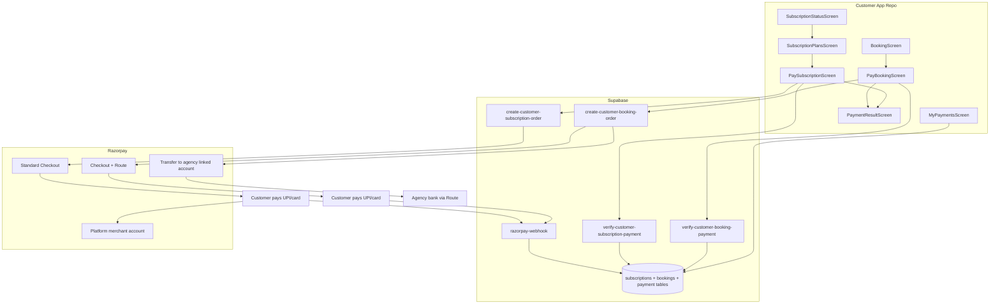

You are implementing **Razorpay online payments** in a **React Native + Expo customer mobile app** for a water-tanker / delivery marketplace. This app serves **individual** and **society** customer users (not admin, not driver).

There are **two separate money flows** in this repo — implement **both** A and B, with **strict separation** between them:

| Flow | Who pays | Who receives | Razorpay product | Settlement | Where implemented |
|------|----------|--------------|------------------|------------|-------------------|
| **A — Customer subscription** | Individual or society customer | **Platform merchant account** | Standard Checkout (no Route transfer) | 100% to platform | **This customer repo** |
| **B — Delivery / booking payment** | Customer | **Agency** (linked account) | **Route** (transfers to `account_id`) | 100% to agency linked account | **This customer repo** |
| **C — Agency platform subscription** | Agency admin | Platform owner | Standard Checkout | Platform | **Admin app repo** (out of scope here) |

**Critical rule:** Subscription money and delivery money must **never** share the same checkout session, Edge Function, or Razorpay order metadata `flow` value.

**Rules (non-negotiable):**

1. **Never trust client amounts** — order amount comes from server (Supabase Edge Function reading `subscription_plans`, `bookings`, or pricing rules).
2. **Webhook is source of truth** — SDK success only triggers verify/poll; final status is set by webhook.
3. **Do not mix subscription checkout with booking checkout** — different Edge Functions, metadata, UI labels, and payment history filters.
4. **Never put `RAZORPAY_KEY_SECRET` or webhook secret in the mobile app** — only `EXPO_PUBLIC_RAZORPAY_KEY_ID` on client.
5. **Flow A (customer subscription):** Razorpay order has **no** `transfers` array — funds settle to the **platform merchant account**.
6. **Flow B (delivery):** Every order must include **`agency_id`** in metadata and a Route **`transfers`** entry so funds settle to the correct agency linked account.
7. **Individual and society users** both subscribe via Flow A (same plans table or plan variants filtered by `account_kind` — confirm with product). Society users currently see a “coming soon” screen; replace it with the same Razorpay subscription flow once plans exist.

### Prerequisites (confirm with platform team before coding)

- [ ] Razorpay **Route** enabled on platform merchant account (required for Flow B only).
- [ ] Agencies onboarded via admin app (`agency_razorpay_accounts` with `razorpay_account_id`, status `active`).
- [ ] Supabase Edge Functions exist (or will be created in backend repo):

  **Subscription (Flow A — platform merchant):**
  - `create-customer-subscription-order`
  - `verify-customer-subscription-payment`

  **Delivery (Flow B — agency Route):**
  - `create-customer-booking-order` (or reuse `create-delivery-order` with `initiator: 'customer'`)
  - `verify-customer-booking-payment`

  **Shared:**
  - `razorpay-webhook` (handles `payment.captured`, `payment.failed`; routes by `notes.flow`)

- [ ] `subscriptions` + `payment_transactions` tables support Razorpay ids (`gateway_order_id`, `gateway_transaction_id`, `payment_gateway: 'razorpay'`).
- [ ] `bookings` table has: `payment_status` (`pending` | `completed` | `failed` | `refunded`), `payment_id`, `agency_id`, `total_price` / `deliveredAmount` as applicable.
- [ ] RLS: customer can only create/read payments for **their own** subscriptions and bookings.
- [ ] `has_active_subscription(user_id)` remains the gate for bookings and society trips (see `docs/SUBSCRIPTION_GATING_REVIEW.md`).

**Product decisions to implement (ask if unclear, use defaults):**

| # | Decision | Default |
|---|----------|---------|
| 1 | Pay **at booking** vs only at delivery on driver app? | **At booking** (prepay or pay-on-confirm) in customer app |
| 2 | Booking created before or after payment? | Create booking `pending` → pay → webhook sets `payment_status=completed` and may confirm booking |
| 3 | Agency without active Route account? | Block online pay; show “Agency cannot accept online payments — try another agency or pay at delivery” |
| 4 | Cash/COD at booking? | Optional: allow booking without Razorpay if `payment_method=cod` and platform allows |
| 5 | Platform commission on delivery transfer? | 0% MVP — 100% transfer to agency linked account |
| 6 | GST line on checkout? | Show if server includes tax in order amount |
| 7 | Individual vs society subscription plans? | Same `subscription_plans` table; filter by `target_account_kind` (`individual` \| `society` \| `both`) if column exists, else shared plans |
| 8 | Migrate from PhonePe? | Replace PhonePe subscription checkout with Razorpay; keep PhonePe behind flag until cutover |
| 9 | Subscription auto-renew? | Manual renew via plans screen for MVP; Razorpay Subscriptions API is Phase 2+ |

### Tech stack expectations

- React Native + Expo
- Supabase Auth + Postgres + Edge Functions
- Zustand (or existing state pattern) for bookings/auth/subscription state
- Install Razorpay React Native SDK (or WebView checkout per project convention)
- Feature flags:
  - `FEATURE_FLAGS.enableOnlinePayment` — Flow B booking checkout
  - `FEATURE_FLAGS.enableRazorpaySubscription` — Flow A (when `false`, keep PhonePe or block subscribe CTA)

### Screens to add or modify

#### Subscription — Flow A (individual + society)

1. **`SubscriptionPlansScreen`** (modify existing)
   - Load plans from server; filter by `customerAccountKind` (`individual` | `society`) when plans are segmented.
   - Primary CTA: **Subscribe with Razorpay** (replace PhonePe copy).
   - Create pending `subscriptions` row → navigate to `PaySubscriptionScreen`.
   - Block subscribe if plan inactive; show renewal CTA when subscription expired.

2. **`PaySubscriptionScreen`** (new — or refactor existing `PaymentScreen`)
   - Params: `subscriptionId`, `planId`, `planName`
   - Amount **from server** via `create-customer-subscription-order`.
   - Legal copy: payment goes to **{platform business name}** for app access / subscription.
   - **No** agency name, **no** Route transfer messaging.
   - On SDK return → `verify-customer-subscription-payment` → activate subscription (`status=active`, set `start_date` / `end_date`) → `SubscriptionStatusScreen`.
   - Metadata flow: `customer_subscription`.

3. **`SubscriptionComingSoonScreen`** (society — modify)
   - Replace placeholder with navigation to `SubscriptionPlansScreen` when `enableRazorpaySubscription=true` and society plans exist.
   - Keep “coming soon” only when no society plans are published.

4. **`SubscriptionStatusScreen`** (modify existing)
   - Show Razorpay payment id, renewal date, **Renew** → `PaySubscriptionScreen`.
   - Refresh `hasActiveSubscription` in auth/store after successful payment.

5. **`MyPaymentsScreen`**
   - Sections or filters: **Subscription payments** (Flow A) vs **Delivery payments** (Flow B).
   - Subscription rows: plan name, period, platform receipt, status.

#### Delivery — Flow B (booking)

6. **`PayBookingScreen`**
   - Params: `bookingId` (or full booking draft before persist)
   - Order summary: agency name, vehicle/capacity, address, scheduled time, **amount from server**
   - Primary CTA: **Pay with Razorpay**
   - Legal copy: payment goes to **{agency business name}**, processed via Razorpay Route
   - States: loading (creating order) · checkout open · processing · success/fail
   - On SDK return → call verify endpoint → navigate to `PaymentResultScreen`
   - Do **not** collect card/UPI in custom inputs

7. **`PaymentResultScreen`** (shared)
   - Params: `type: 'subscription' | 'booking'`, `status`, `subscriptionId?`, `bookingId?`, `referenceId?`
   - Subscription success → `SubscriptionStatusScreen`
   - Booking success → “View order” → `OrderTracking`
   - Failure → **Retry payment** (re-invokes correct Flow A or B create-order function)

#### Modify existing screens

8. **`BookingScreen`**
   - Require active subscription before confirm (individual + society).
   - After user confirms booking details, if online payment enabled and agency Route active:
     - Navigate to `PayBookingScreen` instead of finishing on “Amount at delivery”
   - If agency not onboarded: allow booking with COD only (if platform allows) or block with clear message

9. **`OrderHistoryScreen` / order cards**
   - Payment chip: Unpaid · Paid · Failed · COD
   - Unpaid confirmed bookings → **Pay now** → `PayBookingScreen`

10. **`OrderTrackingScreen`**
    - Show payment status and Razorpay payment id when paid
    - **Pay now** if booking confirmed but `payment_status=pending`

11. **`AddTripScreen` / society trip flows**
    - Gate on `hasActiveSubscription` (society users).
    - Trip settlement payments (if any) are **not** subscription — treat as delivery/agency Flow B if online pay is added later; MVP may remain offline settlement.

12. **`CustomerHomeScreen` / `ProfileScreen`**
    - Link to **Payment history** (`MyPaymentsScreen`)
    - Banner when subscription expired → plans screen
    - Optional banner for failed delivery payments on recent orders

13. **`CustomerNavigator` / `MainNavigator`**
    - Register routes: `PaySubscription`, `PayBooking`, `MyPayments`, `PaymentResult`
    - Typing for stack params

### Client services (create or extend)

**`razorpayCheckout.service.ts`**

- `openCheckout({ orderId, amount, currency, keyId, prefill, description })`
- Handle cancel vs error
- Reuse for both flows; caller passes distinct `description` / receipt label

**`payment.service.ts`** (replace stub / PhonePe paths for subscription)

- `createSubscriptionPayment(subscriptionId)` → Flow A Edge Function
- `verifySubscriptionPayment(subscriptionId, { razorpay_order_id, razorpay_payment_id, razorpay_signature })`
- `createBookingPayment(bookingId)` → Flow B Edge Function
- `verifyBookingPayment(bookingId, { razorpay_order_id, razorpay_payment_id, razorpay_signature })`
- `getPaymentHistory(customerId, { flow?: 'customer_subscription' | 'customer_booking' })`

**`subscription.service.ts`**

- Replace PhonePe `activateSubscription` with Razorpay verify path
- After verify/webhook: refresh subscription row and expose `hasActiveSubscription` to UI

**`booking.service.ts`**

- After payment success (verified), refresh booking; optional `subscribeToBookingUpdates` for `payment_status`

### Backend contract (implement in Supabase if missing — coordinate with admin repo)

**`create-customer-subscription-order`** (Flow A)

1. Validate customer JWT.
2. Load subscription + plan; ensure `user_id` matches caller.
3. Ensure subscription status allows payment (`pending` or renewal of `expired`).
4. Load amount from `subscription_plans.price` — **ignore client-sent amount**.
5. Create Razorpay order **without transfers** (platform merchant receives funds):
   - `notes`: `{ subscription_id, plan_id, user_id, account_kind, flow: 'customer_subscription' }`
6. Insert/update pending row in `payment_transactions` with `payment_gateway: 'razorpay'`.
7. Return `{ orderId, amount, currency, keyId }` to client.

**`verify-customer-subscription-payment`**

1. Verify HMAC signature server-side.
2. Idempotent: if transaction already `success`, return OK.
3. Update `payment_transactions`; set subscription `status=active`, compute `start_date` / `end_date` from plan duration.
4. Reject if `notes.flow !== 'customer_subscription'`.

**`create-customer-booking-order`** (Flow B)

1. Validate customer JWT.
2. Load booking; ensure `customer_id` matches caller.
3. Ensure booking status allows payment (e.g. `pending` / `confirmed`).
4. Load amount from DB (`total_price` or pricing rules) — **ignore client-sent amount**.
5. Load agency `razorpay_account_id`; return 4xx if missing/inactive.
6. Create Razorpay order with **transfer** to agency account:
   - `transfers: [{ account: acc_xxx, amount, currency: 'INR' }]`
   - `notes`: `{ booking_id, agency_id, customer_id, flow: 'customer_booking' }`
7. Insert pending row in `delivery_payment_orders` or `payment_transactions`.
8. Return `{ orderId, amount, currency, keyId }` to client.

**`verify-customer-booking-payment`**

1. Verify HMAC signature server-side.
2. Idempotent: if already `completed`, return OK.
3. Update booking `payment_status`, `payment_id`; confirm booking if business rules require paid-before-confirm.
4. Reject if `notes.flow !== 'customer_booking'`.

**`razorpay-webhook`**

- Idempotent on `razorpay_payment_id`
- Branch on `payment.entity.notes.flow`:
  - `customer_subscription` → subscription + `payment_transactions`
  - `customer_booking` → booking + delivery payment tables
- Never apply a booking webhook payload to a subscription row (and vice versa)

### Environment variables

**Client (`.env`):**

```env
EXPO_PUBLIC_RAZORPAY_KEY_ID=rzp_test_xxx
EXPO_PUBLIC_SUPABASE_URL=...
EXPO_PUBLIC_SUPABASE_ANON_KEY=...
```

**Supabase secrets (backend only):**

```env
RAZORPAY_KEY_ID=...
RAZORPAY_KEY_SECRET=...
RAZORPAY_WEBHOOK_SECRET=...
```

### Security & RLS

- Customer can only pay own subscriptions and own bookings.
- Flow A Edge Functions must reject orders that include Route `transfers`.
- Flow B Edge Functions must require valid `agency_id` and active linked account.
- Driver/admin Edge Functions must not be callable with customer token for agency subscription orders (Flow C).
- Map errors: user cancelled, signature mismatch, agency not onboarded, subscription already active, network timeout.

### User journeys to support

**Journey 1 — Individual customer subscribes (Flow A)**

1. User registers as **individual** → `SubscriptionPlansScreen`
2. Select plan → pending subscription → `PaySubscriptionScreen` → Razorpay (platform merchant)
3. Webhook → subscription `active` → user can book / use app features

**Journey 2 — Society customer subscribes (Flow A)**

1. User registers as **society** → subscription intro → `SubscriptionPlansScreen` (society plans)
2. Same Razorpay checkout as Journey 1; `account_kind: 'society'` in order notes
3. Active subscription unlocks **society trip** creation and bookings

**Journey 3 — Pay delivery at booking (Flow B)**

1. Customer with **active subscription** completes `BookingScreen` → booking created `pending`, `payment_status=pending`
2. `PayBookingScreen` → Razorpay Route → transfer to **selected agency**
3. Webhook → `payment_status=completed` → `OrderTracking` shows confirmed/paid

**Journey 4 — Pay later from history (Flow B)**

1. Order list shows Unpaid → Pay now → same booking checkout flow

**Journey 5 — Failed payment**

1. `PaymentResult` failure → Retry → new order from server (new receipt id) for the same flow type

**Journey 6 — Expired subscription blocks booking**

1. Subscription `end_date` passed → `has_active_subscription` false
2. Booking / add-trip blocked with CTA to renew (Flow A only — no agency transfer)

### Implementation phases (this repo)

| Phase | Deliverable |
|-------|-------------|
| **P0** | SDK + `razorpayCheckout.service` + feature flags + shared types |
| **P1a** | Flow A: `PaySubscriptionScreen` + subscription Edge Functions + migrate off PhonePe |
| **P1b** | Flow B: `PayBookingScreen` + booking Edge Functions + `PaymentResultScreen` |
| **P2** | Wire `SubscriptionPlansScreen`, society intro, subscription gating on booking/trips |
| **P3** | Wire `BookingScreen` + order list/history pay CTAs (Flow B) |
| **P4** | `MyPaymentsScreen` (both flows) + tracking screen payment UI |
| **P5** | Tests, error mapping, realtime on `payment_status` and subscription status |

### Acceptance criteria

- [ ] Test mode: individual customer subscribes → webhook sets subscription `active`; funds on **platform merchant** (no Route transfer on order)
- [ ] Test mode: society customer subscribes with same Flow A pattern
- [ ] Test mode: customer pays for booking → webhook sets `payment_status=completed`; transfer settles to **agency linked account**
- [ ] Subscription and booking checkouts use different Edge Functions and `notes.flow` values
- [ ] Amount on checkout always matches server order (tampering client amount has no effect)
- [ ] Payment with inactive agency account shows clear error, no crash
- [ ] Customer cannot pay another customer’s subscription or booking (RLS + function checks)
- [ ] Expired subscription blocks booking/trip until Flow A renewal succeeds
- [ ] Retry after failure works for both flows
- [ ] Feature flags restore legacy flow with no regression
- [ ] No secret keys in app bundle

### Files to inspect first in this repo

- Navigation: `MainNavigator.tsx`, `rootNavigation.ts`
- Subscription: `SubscriptionPlansScreen.tsx`, `SubscriptionStatusScreen.tsx`, `SubscriptionComingSoonScreen.tsx`, `subscription.service.ts`, `PaymentScreen.tsx` (PhonePe — to replace)
- Booking flow: `BookingScreen.tsx`, `booking.service.ts`, `bookingStore.ts`
- Society: `AddTripScreen.tsx`, `societyTrip.service.ts`, `customerAccountKind` in `authStore`
- Existing payment stub: `payment.service.ts`
- Types: `subscription.types.ts`, `Booking` with `paymentStatus`, `paymentId`, `agencyId`
- Config: `FEATURE_FLAGS`, `ERROR_MESSAGES.payment`
- Gating review: `docs/SUBSCRIPTION_GATING_REVIEW.md`

### Out of scope for this repo

- Agency admin platform subscription (Flow C) — admin repo
- Driver `CollectPaymentScreen` (pay at delivery on driver device) — driver/admin repo
- Agency Razorpay KYC / Route onboarding UI — admin repo
- Society bulk billing settlement to agencies (offline or future Flow B extension) — separate product decision

### Deliverables

1. Working Razorpay checkout for **customer subscriptions** (individual + society) crediting the **platform merchant account**.
2. Working Razorpay checkout for **booking/delivery payments** with Route transfer to the **booking’s agency**.
3. Updated navigation and modified subscription, booking, and order screens.
4. Edge Functions (or PR to backend repo) with webhook idempotency and `flow`-based routing.
5. Brief `docs/RAZORPAY_CUSTOMER_APP.md` documenting both flows, env vars, and test cards.

Start by scanning the repo structure, listing what already exists vs gaps (PhonePe subscription, society coming soon, booking Route pay), then implement **P0 → P1a → P1b** before wiring the full booking and gating flows.

---

## Quick-start prompt (minimal)

Use this when you need a shorter instruction block:

> Implement Razorpay in this **customer** React Native + Expo app with **two isolated flows**: (1) **Customer subscription** for **individual and society** users — standard checkout to the **platform merchant account** via `create-customer-subscription-order` / `verify-customer-subscription-payment`, replacing PhonePe on `SubscriptionPlansScreen`; (2) **Booking delivery payment** — Route transfer to the booking’s **agency** via `create-customer-booking-order`. Shared webhook branches on `notes.flow`. Add `PaySubscriptionScreen`, `PayBookingScreen`, `MyPaymentsScreen`, `PaymentResultScreen`; gate bookings and society trips on `has_active_subscription`; never trust client amounts or store secrets. Agency admin subscription (Flow C) stays in the admin repo.

---

## Money flow diagram



---

## Payment type fields (display & enforce)

### Subscription (Flow A)

| Field | Values / notes |
|-------|----------------|
| `subscriptions.status` | `pending` → `active` after paid |
| `payment_transactions.paymentGateway` | `razorpay` |
| `payment_transactions.metadata.flow` | `customer_subscription` |
| Settlement | Platform merchant only — **no** `agency_id` on order |

### Booking / delivery (Flow B)

| Field | Values / notes |
|-------|----------------|
| `paymentStatus` | `pending` \| `completed` \| `failed` \| `refunded` |
| `paymentId` | Razorpay payment id when completed |
| `agencyId` | Route transfer target |
| `metadata.flow` | `customer_booking` |

---

## Optional: admin/driver repo prompt

A separate prompt for the **admin + driver** repo (agency platform subscription Flow C, driver collect payment, agency Route onboarding) is documented in:

- [`RAZORPAY_IMPLEMENTATION_PHASES.md`](./RAZORPAY_IMPLEMENTATION_PHASES.md)
- [`RAZORPAY_SUBSCRIPTION_AND_PAYMENTS_SCREEN_PLAN.md`](./RAZORPAY_SUBSCRIPTION_AND_PAYMENTS_SCREEN_PLAN.md)

Customer app work should stay aligned with delivery order Edge Functions in that repo; **customer subscription (Flow A) is owned by this customer repo**, not the admin app.

---

*Document version: 1.1 — added customer subscription (individual + society) to platform merchant; delivery payments remain Route to agency.*
