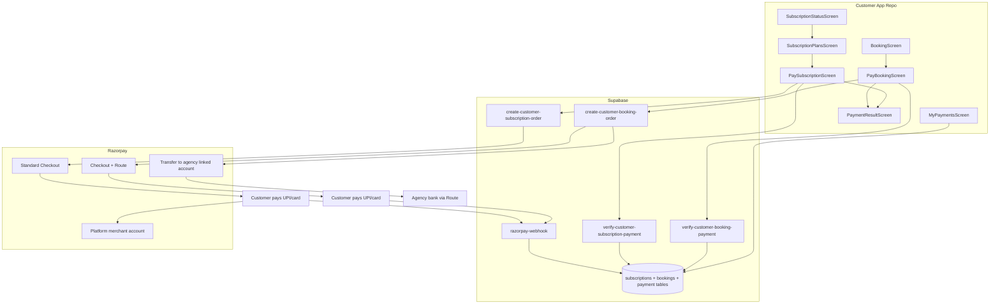

# Razorpay — Customer App Implementation Guide

You are implementing **Razorpay online payments** in a **React Native + Expo customer mobile app** for a water-tanker / delivery marketplace. This app serves **individual** and **society** customer users (not admin, not driver).

---

## Table of contents

1. [Overview — two money flows](#overview--two-money-flows)
2. [Test credentials (Razorpay sandbox)](#test-credentials-razorpay-sandbox)
3. [Prerequisites checklist](#prerequisites-checklist)
4. [Phase 0 — Foundation](#phase-0--foundation)
5. [Phase 1 — Backend Edge Functions](#phase-1--backend-edge-functions)
6. [Phase 2 — Flow A: Customer subscription](#phase-2--flow-a-customer-subscription)
7. [Phase 3 — Flow B: Booking / delivery payment](#phase-3--flow-b-booking--delivery-payment)
8. [Phase 4 — Wire screens & subscription gating](#phase-4--wire-screens--subscription-gating)
9. [Phase 5 — Payment history & order UX](#phase-5--payment-history--order-ux)
10. [Phase 6 — Tests, errors & polish](#phase-6--tests-errors--polish)
11. [Reference — rules, contracts, diagrams](#reference--rules-contracts-diagrams)

---

## Overview — two money flows

Implement **both** Flow A and Flow B with **strict separation** between them:

| Flow | Who pays | Who receives | Razorpay product | Settlement | Where implemented |
|------|----------|--------------|------------------|------------|-------------------|
| **A — Customer subscription** | Individual or society customer | **Platform merchant account** | Standard Checkout (no Route transfer) | 100% to platform | **This customer repo** |
| **B — Delivery / booking payment** | Customer | **Agency** (linked account) | **Route** (transfers to `account_id`) | 100% to agency linked account | **This customer repo** |
| **C — Agency platform subscription** | Agency admin | Platform owner | Standard Checkout | Platform | **Admin app repo** (out of scope) |

**Critical rule:** Subscription money and delivery money must **never** share the same checkout session, Edge Function, or Razorpay order metadata `flow` value.

### Non-negotiable rules

1. **Never trust client amounts** — order amount comes from server (Supabase Edge Function reading `subscription_plans`, `bookings`, or pricing rules).
2. **Webhook is source of truth** — SDK success only triggers verify/poll; final status is set by webhook.
3. **Do not mix subscription checkout with booking checkout** — different Edge Functions, metadata, UI labels, and payment history filters.
4. **Never put `RAZORPAY_KEY_SECRET` or webhook secret in the mobile app** — only `EXPO_PUBLIC_RAZORPAY_KEY_ID` on client.
5. **Flow A:** Razorpay order has **no** `transfers` array — funds settle to the **platform merchant account**.
6. **Flow B:** Every order must include **`agency_id`** in metadata and a Route **`transfers`** entry.
7. **Individual and society users** both subscribe via Flow A. Society users currently see a “coming soon” screen; replace it with the same Razorpay subscription flow once plans exist.

### Current repo state (scan before starting)

| Area | Status |
|------|--------|
| Subscription checkout | PhonePe via `PaymentScreen` + `phonepe.service.ts` |
| Booking online pay | COD stub in `payment.service.ts`; `enableOnlinePayment: false` |
| Society subscription | `SubscriptionComingSoonScreen` placeholder |
| Payment history | `PaymentHistoryScreen` exists (extend for Razorpay) |
| Feature flags | `enableOnlinePayment`, `enableSubscriptionGating` in `config.ts` |

**Recommended order:** Phase 0 → Phase 1 (backend) → Phase 2 (Flow A) → Phase 3 (Flow B) → Phase 4 → Phase 5 → Phase 6.

---

## Test credentials (Razorpay sandbox)

Use these **test mode** keys for development. Do **not** use live keys until production cutover.

| Variable | Value | Where to set |
|----------|-------|--------------|
| **Key ID** (public) | `rzp_test_SvZ3J7Z3onV3qK` | Client `.env` as `EXPO_PUBLIC_RAZORPAY_KEY_ID` |
| **Key Secret** (private) | `7ICKfU0ycfh197WzY6gj1EnC` | **Supabase Edge Function secrets only** — never in app code or Git |

### Client `.env` (copy from `.env.example`)

```env
EXPO_PUBLIC_RAZORPAY_KEY_ID=rzp_test_SvZ3J7Z3onV3qK
EXPO_PUBLIC_SUPABASE_URL=https://your-project-id.supabase.co
EXPO_PUBLIC_SUPABASE_ANON_KEY=your-anon-key-here
```

### Supabase secrets (Dashboard → Project Settings → Edge Functions → Secrets)

```env
RAZORPAY_KEY_ID=rzp_test_SvZ3J7Z3onV3qK
RAZORPAY_KEY_SECRET=7ICKfU0ycfh197WzY6gj1EnC
RAZORPAY_WEBHOOK_SECRET=<set after creating webhook in Razorpay Dashboard>
```

### Razorpay test cards / UPI (checkout UI)

| Method | Details |
|--------|---------|
| **Success card** | `4111 1111 1111 1111`, any future expiry, any CVV |
| **Failure card** | `4000 0000 0000 0002` |
| **Test UPI** | `success@razorpay` (success) / `failure@razorpay` (failure) |

> **Security:** Do not commit `.env` with real values. If this doc or chat is shared publicly, rotate the test secret in the Razorpay Dashboard.

---

## Prerequisites checklist

Complete (or confirm with platform team) **before Phase 2**:

- [ ] Razorpay **Route** enabled on platform merchant account (required for Flow B only).
- [ ] Agencies onboarded via admin app (`agency_razorpay_accounts` with `razorpay_account_id`, status `active`).
- [ ] `subscriptions` + `payment_transactions` tables support Razorpay ids (`gateway_order_id`, `gateway_transaction_id`, `payment_gateway: 'razorpay'`).
- [ ] `bookings` table has: `payment_status`, `payment_id`, `agency_id`, `total_price` / `deliveredAmount`.
- [ ] RLS: customer can only create/read payments for **their own** subscriptions and bookings.
- [ ] `has_active_subscription(user_id)` remains the gate for bookings and society trips (see `docs/SUBSCRIPTION_GATING_REVIEW.md`).

### Product defaults (use unless product says otherwise)

| # | Decision | Default |
|---|----------|---------|
| 1 | Pay at booking vs at delivery? | **At delivery** in customer app |
| 2 | Booking before payment? | Create booking `pending` → pay → webhook sets `payment_status=completed` |
| 3 | Agency without Route account? | Block online pay; show clear message |
| 4 | Cash/COD at booking? | No amount charged at booking, charged only at the time of delivery |
| 5 | Platform commission on delivery |  100% to agency |
| 6 | Individual vs society plans? | Different plans for individual and society plans |
| 7 | PhonePe migration | Replace with Razorpay; keep PhonePe behind flag until cutover |
| 8 | Auto-renew | Manual renew for MVP; Razorpay Subscriptions API is later |

---

## Phase 0 — Foundation

**Goal:** Install SDK, env vars, shared types, feature flags, and a reusable checkout wrapper. No user-facing payment yet.

**Depends on:** Test credentials configured locally.

### Tasks

- [ ] Install Razorpay React Native SDK (or confirm WebView checkout convention with team).
- [ ] Add `EXPO_PUBLIC_RAZORPAY_KEY_ID` to `.env` and `.env.example` (placeholder in example, real value in local `.env` only).
- [ ] Add feature flags in `src/constants/config.ts`:
  - `enableRazorpaySubscription: false` — Flow A (when `false`, keep PhonePe or block subscribe CTA)
  - `enableOnlinePayment: false` — Flow B booking checkout (already exists; wire to Razorpay)
- [ ] Create `src/types/razorpay.types.ts`:
  - `RazorpayCheckoutParams`, `RazorpayVerifyPayload`, `PaymentFlow = 'customer_subscription' | 'customer_booking'`
- [ ] Create `src/services/razorpayCheckout.service.ts`:
  - `openCheckout({ orderId, amount, currency, keyId, prefill, description })`
  - Handle user cancel vs SDK error; return structured result to callers
- [ ] Extend `ERROR_MESSAGES.payment` in `config.ts` for Razorpay-specific user messages.
- [ ] Run `npm run secrets:check` (or equivalent) to ensure no secret keys under `src/`.

### Files

| Action | Path |
|--------|------|
| Create | `src/services/razorpayCheckout.service.ts` |
| Create | `src/types/razorpay.types.ts` |
| Modify | `src/constants/config.ts` |
| Modify | `.env.example` |
| Modify | `src/services/index.ts` (export new service) |

### Verify Phase 0

- [ ] App builds with new env var (Key ID only).
- [ ] `openCheckout` can be invoked in dev with a **manual test order** from Razorpay Dashboard or mock params (optional smoke test).
- [ ] No `RAZORPAY_KEY_SECRET` anywhere in client bundle.

---

## Phase 1 — Backend Edge Functions

**Goal:** Supabase Edge Functions + webhook that create orders server-side and verify signatures. Can be done in backend repo; customer app unblocks after this phase.

**Depends on:** Supabase secrets set (see [Test credentials](#test-credentials-razorpay-sandbox)).

### Functions to create

| Function | Flow | Purpose |
|----------|------|---------|
| `create-customer-subscription-order` | A | Create order **without** transfers |
| `verify-customer-subscription-payment` | A | HMAC verify + activate subscription |
| `create-customer-booking-order` | B | Create order **with** Route transfer |
| `verify-customer-booking-payment` | B | HMAC verify + update booking |
| `razorpay-webhook` | A + B | Idempotent; branch on `notes.flow` |

### Tasks — Flow A (`create-customer-subscription-order`)

- [ ] Validate customer JWT.
- [ ] Load subscription + plan; ensure `user_id` matches caller.
- [ ] Ensure status allows payment (`pending` or renewal of `expired`).
- [ ] Load amount from `subscription_plans.price` — **ignore client amount**.
- [ ] Create Razorpay order **without transfers**:
  - `notes`: `{ subscription_id, plan_id, user_id, account_kind, flow: 'customer_subscription' }`
- [ ] Insert/update `payment_transactions` with `payment_gateway: 'razorpay'`.
- [ ] Return `{ orderId, amount, currency, keyId }`.

### Tasks — Flow A (`verify-customer-subscription-payment`)

- [ ] Verify HMAC signature server-side.
- [ ] Idempotent if transaction already `success`.
- [ ] Update `payment_transactions`; set subscription `status=active`, `start_date` / `end_date`.
- [ ] Reject if `notes.flow !== 'customer_subscription'`.

### Tasks — Flow B (`create-customer-booking-order`)

- [ ] Validate customer JWT; booking `customer_id` matches.
- [ ] Load amount from DB — **ignore client amount**.
- [ ] Load agency `razorpay_account_id`; return 4xx if missing/inactive.
- [ ] Create order with Route transfer:
  - `transfers: [{ account: acc_xxx, amount, currency: 'INR' }]`
  - `notes`: `{ booking_id, agency_id, customer_id, flow: 'customer_booking' }`
- [ ] Insert pending payment row; return `{ orderId, amount, currency, keyId }`.

### Tasks — Flow B (`verify-customer-booking-payment`)

- [ ] Verify HMAC; idempotent if already `completed`.
- [ ] Update booking `payment_status`, `payment_id`.
- [ ] Reject if `notes.flow !== 'customer_booking'`.

### Tasks — `razorpay-webhook`

- [ ] Register webhook URL in Razorpay Dashboard (test mode).
- [ ] Store `RAZORPAY_WEBHOOK_SECRET` in Supabase secrets.
- [ ] Handle `payment.captured`, `payment.failed`; idempotent on `razorpay_payment_id`.
- [ ] Branch on `payment.entity.notes.flow`:
  - `customer_subscription` → subscription + `payment_transactions`
  - `customer_booking` → booking + delivery payment tables

### Verify Phase 1

- [ ] curl/Postman: create subscription order returns valid `orderId` and amount from DB.
- [ ] curl: create booking order includes `transfers` when agency is active; 4xx when not.
- [ ] Test payment in Razorpay Dashboard → webhook updates DB (check Supabase logs).
- [ ] Flow A order rejected if `transfers` present; Flow B rejected without valid agency.

---

## Phase 2 — Flow A: Customer subscription

**Goal:** Individual + society customers can subscribe via Razorpay; funds go to **platform merchant** (no Route).

**Depends on:** Phase 0 + Phase 1 (subscription Edge Functions deployed).

### Tasks

- [ ] Extend `src/services/payment.service.ts`:
  - `createSubscriptionPayment(subscriptionId)` → `create-customer-subscription-order`
  - `verifySubscriptionPayment(subscriptionId, { razorpay_order_id, razorpay_payment_id, razorpay_signature })`
- [ ] Update `src/services/subscription.service.ts`:
  - Replace PhonePe `activateSubscription` path with Razorpay verify when `enableRazorpaySubscription=true`
  - Refresh `hasActiveSubscription` in auth/store after success
- [ ] Create **`PaySubscriptionScreen`** (or refactor `PaymentScreen.tsx`):
  - Params: `subscriptionId`, `planId`, `planName`
  - Amount from server only via create-order
  - Legal copy: payment to **platform business name** for app access — **no** agency / Route messaging
  - On SDK return → verify → navigate to `SubscriptionStatusScreen` or shared `PaymentResultScreen`
  - Metadata flow: `customer_subscription`
- [ ] Modify **`SubscriptionPlansScreen`**:
  - Primary CTA: **Subscribe with Razorpay** when flag on
  - Create pending `subscriptions` row → navigate to `PaySubscriptionScreen`
  - Filter plans by `customerAccountKind` when segmented
- [ ] Modify **`SubscriptionStatusScreen`**:
  - Show Razorpay payment id, renewal date, **Renew** → `PaySubscriptionScreen`
- [ ] Register route `PaySubscription` in `MainNavigator.tsx` + `rootNavigation.ts` types
- [ ] Keep PhonePe behind `enableRazorpaySubscription === false` for rollback

### Files

| Action | Path |
|--------|------|
| Create / refactor | `src/screens/customer/PaySubscriptionScreen.tsx` |
| Modify | `src/screens/customer/SubscriptionPlansScreen.tsx` |
| Modify | `src/screens/customer/SubscriptionStatusScreen.tsx` |
| Modify | `src/services/payment.service.ts` |
| Modify | `src/services/subscription.service.ts` |
| Modify | `src/navigation/MainNavigator.tsx`, `rootNavigation.ts` |

### User journey (test this phase)

1. Individual user → `SubscriptionPlansScreen` → select plan → `PaySubscriptionScreen`
2. Complete Razorpay test checkout (`success@razorpay` or test card)
3. Webhook + verify → subscription `active` → booking/trip gates unlock (Phase 4)

### Verify Phase 2

- [ ] Test mode: subscribe → webhook sets subscription `active`; **no** Route transfer on order
- [ ] Society user can use same flow with `account_kind: 'society'` in order notes
- [ ] Tampering client amount has no effect (server order amount wins)
- [ ] User cancel shows friendly message, no crash
- [ ] Feature flag off → PhonePe or blocked CTA still works

---

## Phase 3 — Flow B: Booking / delivery payment

**Goal:** Customer pays for a booking at checkout; funds Route to **agency linked account**.

**Depends on:** Phase 0 + Phase 1 (booking Edge Functions + Route-enabled agencies).

### Tasks

- [ ] Extend `payment.service.ts`:
  - `createBookingPayment(bookingId)` → `create-customer-booking-order`
  - `verifyBookingPayment(bookingId, verify payload)`
- [ ] Create **`PayBookingScreen`**:
  - Params: `bookingId`
  - Order summary: agency name, vehicle, address, time, **amount from server**
  - Legal copy: payment to **{agency business name}** via Razorpay Route
  - States: loading · checkout open · processing · success/fail
  - On SDK return → verify → `PaymentResultScreen`
- [ ] Create **`PaymentResultScreen`** (shared with Flow A):
  - Params: `type: 'subscription' | 'booking'`, `status`, ids, `referenceId?`
  - Success: subscription → `SubscriptionStatus`; booking → `OrderTracking`
  - Failure: **Retry** re-invokes correct create-order for same flow type
- [ ] Update `booking.service.ts`: refresh booking after verify; optional realtime on `payment_status`
- [ ] Register routes `PayBooking`, `PaymentResult` in navigator

### Files

| Action | Path |
|--------|------|
| Create | `src/screens/customer/PayBookingScreen.tsx` |
| Create | `src/screens/shared/PaymentResultScreen.tsx` |
| Modify | `src/services/payment.service.ts` |
| Modify | `src/services/booking.service.ts` |
| Modify | `src/navigation/MainNavigator.tsx`, `rootNavigation.ts` |

### User journey (test this phase)

1. Customer with active subscription creates booking (`payment_status=pending`)
2. `PayBookingScreen` → Razorpay → webhook sets `payment_status=completed`
3. `OrderTracking` shows paid status

### Verify Phase 3

- [ ] Test mode: booking payment → transfer to agency linked account in Razorpay Dashboard
- [ ] Inactive agency → clear error, no crash
- [ ] Subscription and booking use **different** Edge Functions and `notes.flow` values
- [ ] Retry after failure creates new server order (new receipt id)

---

## Phase 4 — Wire screens & subscription gating

**Goal:** Connect payment flows into existing booking, society, and home/profile UX; enforce subscription gates.

**Depends on:** Phase 2 (Flow A live for gating to matter).

### Tasks

- [ ] **`BookingScreen`**: after confirm, if `enableOnlinePayment` + agency Route active → `PayBookingScreen`; else COD or block with message
- [ ] Require active subscription before confirm (`enableSubscriptionGating=true`)
- [ ] **`SubscriptionComingSoonScreen`**: when society plans exist + `enableRazorpaySubscription` → navigate to `SubscriptionPlansScreen`
- [ ] **`AddTripScreen` / society flows**: gate on `hasActiveSubscription`
- [ ] **`CustomerHomeScreen` / `ProfileScreen`**: expired subscription banner → plans; link to payment history
- [ ] Enable flags when ready: `enableRazorpaySubscription`, `enableOnlinePayment`, `enableSubscriptionGating`

### Files

| Action | Path |
|--------|------|
| Modify | `src/screens/customer/BookingScreen.tsx` |
| Modify | `src/screens/society/SubscriptionComingSoonScreen.tsx` |
| Modify | `src/screens/society/AddTripScreen.tsx` (or equivalent) |
| Modify | `src/constants/config.ts` (feature flags) |

### Verify Phase 4

- [ ] Expired subscription blocks booking/trip with renew CTA
- [ ] Society intro no longer “coming soon” when plans published
- [ ] Booking with onboarded agency routes to online pay; without → COD or error per product default

---

## Phase 5 — Payment history & order UX

**Goal:** Unified payment history and pay-now entry points on orders.

**Depends on:** Phase 2 + Phase 3.

### Tasks

- [ ] Extend or alias **`MyPaymentsScreen`** from existing `PaymentHistoryScreen`:
  - Sections/filters: **Subscription** (Flow A) vs **Delivery** (Flow B)
  - `getPaymentHistory(customerId, { flow? })` in `payment.service.ts`
- [ ] **`PastOrdersScreen` / order cards**: payment chip (Unpaid · Paid · Failed · COD); **Pay now** → `PayBookingScreen`
- [ ] **`OrderTrackingScreen`**: show payment status + Razorpay id; **Pay now** if `payment_status=pending`

### Files

| Action | Path |
|--------|------|
| Modify | `src/screens/customer/PaymentHistoryScreen.tsx` |
| Modify | `src/screens/customer/PastOrdersScreen.tsx` |
| Modify | `src/screens/customer/OrderTrackingScreen.tsx` |
| Modify | `src/services/payment.service.ts` |

### Verify Phase 5

- [ ] History shows both subscription and delivery rows with correct labels
- [ ] Pay now from order list/tracking completes Flow B end-to-end

---

## Phase 6 — Tests, errors & polish

**Goal:** Automated tests, error mapping, optional realtime, and documentation.

### Tasks

- [ ] Unit tests: `razorpayCheckout.service`, `payment.service` (mock Edge Functions)
- [ ] Update `src/__tests__/flows/paymentFlow.test.ts` for both flows
- [ ] Navigation tests for new routes
- [ ] Map errors: user cancelled, signature mismatch, agency not onboarded, subscription already active, network timeout
- [ ] Optional: realtime subscription on booking `payment_status`
- [ ] Create `docs/RAZORPAY_CUSTOMER_APP.md` — flows, env vars, test cards (brief runbook)
- [ ] Final acceptance pass (checklist below)

### Verify Phase 6 — full acceptance criteria

- [ ] Test mode: individual + society subscribe (Flow A); funds on platform merchant
- [ ] Test mode: booking pay (Flow B); transfer to agency linked account
- [ ] Amount on checkout always matches server order
- [ ] Customer cannot pay another user’s subscription or booking (RLS + function checks)
- [ ] Retry after failure works for both flows
- [ ] Feature flags restore legacy flow with no regression
- [ ] No secret keys in app bundle

---

## Reference — rules, contracts, diagrams

### Tech stack

- React Native + Expo
- Supabase Auth + Postgres + Edge Functions
- Zustand (or existing state) for auth/booking/subscription
- Razorpay React Native SDK (or WebView per convention)

### Files to inspect first

| Area | Paths |
|------|-------|
| Navigation | `MainNavigator.tsx`, `rootNavigation.ts` |
| Subscription | `SubscriptionPlansScreen.tsx`, `SubscriptionStatusScreen.tsx`, `SubscriptionComingSoonScreen.tsx`, `subscription.service.ts`, `PaymentScreen.tsx` (PhonePe) |
| Booking | `BookingScreen.tsx`, `booking.service.ts`, `bookingStore.ts` |
| Society | `AddTripScreen.tsx`, `societyTrip.service.ts`, `authStore` (`customerAccountKind`) |
| Payment stub | `payment.service.ts` |
| Types | `subscription.types.ts`, `Booking` (`paymentStatus`, `paymentId`, `agencyId`) |
| Config | `FEATURE_FLAGS`, `ERROR_MESSAGES.payment` |
| Gating | `docs/SUBSCRIPTION_GATING_REVIEW.md` |

### Payment type fields

**Subscription (Flow A)**

| Field | Values / notes |
|-------|----------------|
| `subscriptions.status` | `pending` → `active` after paid |
| `payment_transactions.paymentGateway` | `razorpay` |
| `payment_transactions.metadata.flow` | `customer_subscription` |
| Settlement | Platform merchant only — **no** `agency_id` on order |

**Booking (Flow B)**

| Field | Values / notes |
|-------|----------------|
| `paymentStatus` | `pending` \| `completed` \| `failed` \| `refunded` |
| `paymentId` | Razorpay payment id when completed |
| `agencyId` | Route transfer target |
| `metadata.flow` | `customer_booking` |

### Money flow diagram



### Out of scope (this repo)

- Agency admin platform subscription (Flow C) — admin repo
- Driver `CollectPaymentScreen` — driver/admin repo
- Agency Razorpay KYC / Route onboarding UI — admin repo
- Society bulk billing settlement — separate product decision

### Related docs

- [`RAZORPAY_IMPLEMENTATION_PHASES.md`](./RAZORPAY_IMPLEMENTATION_PHASES.md) — admin/driver repo
- [`RAZORPAY_SUBSCRIPTION_AND_PAYMENTS_SCREEN_PLAN.md`](./RAZORPAY_SUBSCRIPTION_AND_PAYMENTS_SCREEN_PLAN.md)

### Quick-start prompt (minimal)

> Implement Razorpay in this **customer** React Native + Expo app with **two isolated flows**: (1) **Customer subscription** for **individual and society** users — standard checkout to the **platform merchant account** via `create-customer-subscription-order` / `verify-customer-subscription-payment`, replacing PhonePe on `SubscriptionPlansScreen`; (2) **Booking delivery payment** — Route transfer to the booking’s **agency** via `create-customer-booking-order`. Shared webhook branches on `notes.flow`. Add `PaySubscriptionScreen`, `PayBookingScreen`, `MyPaymentsScreen`, `PaymentResultScreen`; gate bookings and society trips on `has_active_subscription`; never trust client amounts or store secrets. Use test Key ID `rzp_test_SvZ3J7Z3onV3qK` on client; secret in Supabase only.

---

*Document version: 2.0 — phase-wise implementation guide with Razorpay test credentials.*
